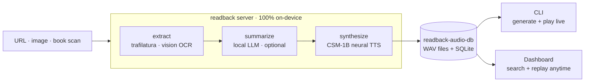
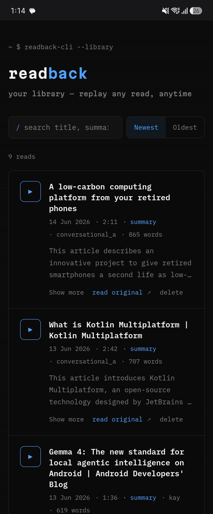
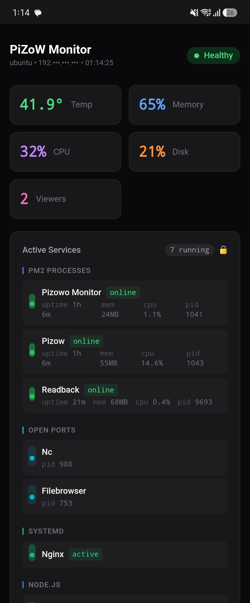

<p align="center">
  
</p>

<p align="center">
  <strong>Make reading interesting again.</strong><br>
  Paste a URL or drop a book scan — get a clean, natural-voice reading of the whole piece,<br>
  right in your terminal. Runs entirely on your Mac.<br>
  No cloud. No API keys. Nothing leaves your machine.
</p>

<p align="center">
  
  
  
</p>

<p align="center">
  <a href="https://github.com/MKS-01/readback/actions/workflows/ci.yml"></a>
</p>

<p align="center">
  
  
  
  
  
  
  
  
  
</p>

<p align="center">
  <sub>🤖 Built agent-first with Claude Code — <a href="docs/JOURNEY.md"><strong>read the devlog →</strong></a></sub>
</p>

<p align="center">
  <a href="https://mks-01.github.io/readback/">Landing page</a> ·
  <a href="#getting-started">Getting started</a> ·
  <a href="#how-it-works">How it works</a> ·
  <a href="#voices">Voices</a> ·
  <a href="#configuration">Config</a> ·
  <a href="#documentation">Docs</a> ·
  <a href="docs/ROADMAP.md">Roadmap</a>
</p>

<p align="center">
  <br>
  <sub>The terminal client mid-read: seekable player, live word-by-word transcript sync.</sub>
</p>

<p align="center">
  <strong>🔊 <a href="docs/media/sample-read.wav">Hear a sample read</a></strong><br>
  <sub>A real Summary-mode read (local LLM + CSM-1B) in <strong>codeword</strong> — a custom-tuned clone voice</sub>
</p>

---

## Why I built this

I read a lot, but there's a whole pile of *good writing* I never get to — some
days I'd just rather listen than read another wall of text, so I built readback
to do exactly that. I've been tinkering with voice agents since college (2015), back when it
was a basic speech-to-text → text-to-speech loop held together with duct tape;
readback is that same itch leveled up — a local LLM and a neural voice (CSM-1B),
all on-device, no accounts, nothing phoning home. It lives in the terminal,
where it always felt most at home. Made to make reading interesting again.

> **It's also my workbench.** I'm a builder getting back into it after a long
> break, and readback is where I'm brushing up the whole stack — built
> **agent-first with Claude Code**. The breadth is deliberate: each slice
> exercises a different muscle. And it's **end-to-end mine** — I don't just wire
> up the engineering, I **design it too**: the look, the motion, the feel are my
> own taste, here and across the full-stack projects I build.
>
> | Slice | What it exercises |
> |---|---|
> | `src/readback/` package + `pyproject.toml` | Python packaging, src-layout, dependencies |
> | FastAPI + `/ws` + background tasks | async server, protocol design, cancellation |
> | Terminal CLI (Bun + Ink) | React model for CLIs, process supervision, TTY quirks |
> | Web dashboard (Vue 3 + Vite) | modern frontend + build tooling |
> | SQLite library | data modeling, search, pagination |
> | csm-mlx / LoRA | on-device ML, MLX/Metal, fine-tuning |
> | deploy/sync scripts + Pi | shell, devops, real deployment |
> | `pytest` suite + GitHub Actions CI | testing pure logic, CI matrices, fast feedback |
> | **design system + UX** (Ghost palette, motion, CLI ↔ web ↔ landing parity) | product design, interaction & motion, visual taste |
> | docs / versioning / reviews | the unglamorous senior-engineer hygiene |

---

## Getting started

> **readback runs on macOS — Apple Silicon (M1–M5).** The CSM-1B voice needs
> MLX/Metal, so an M-series Mac is required. Developed on an **M5 Pro — 18-core
> CPU, 20-core GPU, 48 GB**; synthesis speed scales with your GPU and unified
> memory.

**First time? One command sets it all up:**

```bash
git clone https://github.com/MKS-01/readback.git && cd readback
bash scripts/setup.sh
```

`scripts/setup.sh` is the single setup script — safe to re-run, it skips whatever
is already done. It will:

- check macOS / Apple Silicon and find a **Python 3.10–3.12**,
- create `.venv` and install readback (pulls the `csm-mlx` git dependency),
- build + install the **terminal CLI** (`~/.local/bin/readback-cli`) and the **web dashboard**,
- offer to pull the **Ollama summary model** (for Summary mode) and to pre-download the **CSM-1B voice weights** (~6 GB) so your first read is instant.

It still needs [Bun](https://bun.sh/) (for the CLI + dashboard) and, for Summary
mode, [Ollama](https://ollama.ai/) — the script tells you if either is missing.
Then read something:

```bash
readback-cli            # from anywhere; auto-starts the server
```

That's it — paste a URL, watch the progress, and the audio plays right in your
shell via `afplay`.

<details>
<summary><strong>Prefer to set it up by hand?</strong></summary>

```bash
# 1. Ollama for Summary mode (skip if you only want Full mode)
ollama serve &                          # or launch the desktop app
ollama pull qwen3.5:9b                  # default; any chat model works

# 2. Install the server
git clone https://github.com/MKS-01/readback.git && cd readback
python3.11 -m venv .venv && source .venv/bin/activate
pip install -e .                        # csm-mlx is a git dep, pulled automatically

# 3. Build + install the terminal client → ~/.local/bin/readback-cli
cd src/cli && ./install.sh && cd ..

# 4. Read something
readback-cli                            # from anywhere; auto-starts the server
```
</details>

<p align="center">
  
</p>

The CLI auto-starts the `readback` server if one isn't already running, and
shuts it down on exit if it started it. A real terminal player: space = pause,
**←/→ = seek ±5 s**, t = transcript in Summary mode — with the spoken summary
**highlighting word by word in sync with the voice**. Slash commands `/voice`,
`/model` (pick the summary LLM from your local Ollama models, with a RAM-fit
check), `/mode`, `/library` (browse + replay past reads), `/help`, `/quit` — or
press `q` when the input field is empty. Same Ghost look, plus an Xcode-blue accent. macOS
only. Details: [`src/cli/README.md`](src/cli/README.md).

<p align="center">
  <br>
  <sub><code>/model</code> — every local Ollama model, sized up against your Mac's RAM before you commit.</sub>
</p>

<p align="center">
  <br>
  <sub><code>/lib</code> — browse past reads; metadata and a summary preview appear for the selected item.</sub>
</p>

<p align="center">
  <br>
  <sub><code>/help</code> — every command and player key at a glance.</sub>
</p>

On the **first read**, the CSM-1B weights (~6 GB) download from Hugging Face (no
login) and the MLX graph warms up — so the first synthesis is slow; later runs
are fast. See [SETUP.md](docs/SETUP.md) for verification, flags, and troubleshooting.

---

## Library dashboard

Generating a read is the heavy part — fetch, an optional LLM summary pass, and
CSM-1B synthesis all run on your Mac's GPU. But you pay that **once**: every read
is recorded in a small local SQLite library, and the dashboard lets you **replay
any past read anytime** — no LLM, no GPU, just the saved audio.

<p align="center">
  <br>
  <sub>The library dashboard: search, sort, and one-click replay of every past read — each with a seekable player and the same word-by-word transcript highlight as the CLI.</sub>
</p>

- **Search** title / summary / URL, **sort** newest↔oldest, and **paginate** —
  the list loads 20 at a time with a "Load more" button (so the library stays
  fast as it grows).
- **Full player** on each card — click-to-seek bar, ±5 s skips, pause / resume /
  replay, and `space` + `←/→` keyboard shortcuts (the same keys as the CLI).
- **Synced transcript** — a Summary read highlights **word by word in blue** as it
  plays, identical to the terminal player.
- **Read the original** for further reading, or **delete** a read (removes its DB
  row *and* its WAV).

It's a lightweight **Vue 3** SPA — a pure REST + static client, no new Python at
read time, and the same Ghost design system (and fonts) as the CLI and landing
page.

```bash
cd src/dashboard && bun run build                   # → dist/
readback                                            # then open http://127.0.0.1:8000/
```

Built `dist/` is served by the same `readback` process at `/`; for development,
`bun run dev` runs Vite on `:5173` and proxies to the server.

### Why generation stays on the CLI

The LLM summary is a **heavy, occasional task** — you don't re-summarize an
article every time you want to *hear* it, and the model work (a local LLM plus
neural TTS) wants your Mac's GPU and unified memory. So readback deliberately
splits the two halves:

- **Generate on demand**, from the terminal — the CLI drives the LLM + CSM
  pipeline on the Mac. This is the part that costs RAM and GPU, and it runs only
  when you actually want a new read.
- **Replay anywhere**, from the dashboard — which never touches the LLM or TTS; it
  only lists rows and serves a finished WAV, so it stays tiny and fast.

That separation also makes a split deploy clean: the Mac generates and writes WAVs;
a home Pi hosts the lightweight UI and serves the audio. See
[Pi deployment](#pi-deployment) below. Details: [`src/dashboard/README.md`](src/dashboard/README.md).

---

## How it works

readback is one on-device pipeline with two clients — the terminal **CLI**
(generate + play live, over a WebSocket) and the web **dashboard** (replay past
reads, over REST) — the same pipeline whether you're reading a news piece or a
10,000-word essay.



The read pipeline, left to right:

1. **Extract** — `trafilatura` pulls the article body (browser-UA fallback for sites that 403), then light scrubbing removes URLs and citation markers so they aren't read aloud. Local images (`.png`, `.jpg`, `.heic`, …) are OCR'd via an Ollama vision model instead. A folder path or glob (`~/scan/` or `~/page*.png`) is read as multi-page: every page is OCR'd in filename order and stitched into one continuous document — ideal for book scans.
2. **Summarize** (Summary mode only) — one call to the local LLM via Ollama rewrites the article (or stitched book pages) as a spoken explanation. Full mode skips this entirely — no LLM involved.
3. **Chunk + synthesize** — the text is split into sentence-aware chunks, each synthesized with CSM-1B, silence-trimmed, and joined with small gaps.
4. **Serve** — the finished WAV is served over HTTP to whichever client asked; progress streams live over the WebSocket while it's being made.

**Source-aware tone.** readback adapts to what you give it: a URL reads as a livelier
article explainer, while an image or book scan reads as a measured *book* — narrated
a touch calmer, and (in Summary mode) opening by naming the chapter or topic pulled
from the page's first lines. Automatic, picked from the source — nothing to set.
Long book scans aren't truncated, either: the summary **map-reduces** across the
whole document so the tail isn't dropped.

CSM runs on one MLX/Metal thread (MLX binds its GPU stream to the first thread
that touches it), so read jobs queue naturally. The CLI is a pure client — it
adds zero server code, just spawns and supervises the same `readback` process
you'd start by hand. A second, lighter client — the [library
dashboard](#library-dashboard) — replays *past* reads over plain REST (no
WebSocket, no models), so generating and listening-again are cleanly separate.
See [ARCHITECTURE.md](docs/ARCHITECTURE.md) for the full system view.

---

## Tech stack

| Layer | Technology |
|---|---|
| **Extraction** | [trafilatura](https://trafilatura.readthedocs.io/) — URL → clean text (+ browser-UA fallback); **Ollama vision OCR** for images / book scans |
| **Summary (optional)** | [Ollama](https://ollama.ai/) — default `qwen3.5:9b`; any pulled chat model works |
| **TTS** | [CSM-1B](https://huggingface.co/senstella/csm-1b-mlx) (Sesame) via [csm-mlx](https://github.com/senstella/csm-mlx) — MLX/Metal, 24 kHz, fp32 |
| **Voices** | 2 built-in reading voices + **clone any voice from a short clip** + optional **LoRA fine-tuning** |
| **Server** | [FastAPI](https://fastapi.tiangolo.com/) + WebSocket — streams progress, serves the WAV, REST library |
| **CLI client** | Bun + TypeScript + [Ink](https://github.com/vadimdemedes/ink) — terminal UI, `afplay` playback |
| **Dashboard** | [Vue 3](https://vuejs.org/) + [Vite](https://vite.dev/) + TS — replay past reads (search/sort/player); stdlib SQLite library |

---

## Voices

readback's voice comes from a short **reference clip** that CSM conditions on —
the clip's timbre, age, and accent are what you hear.

- **Built-in** — `conversational_a` (female ★) / `conversational_b` (male), an even literary reading tone. English-best.
- **Clone** — drop a clean 5–8 s mono clip into `src/voice/` and register it under `tts.csm.voices` (the bundled config ships a sample `codeword` voice):

  ```yaml
  tts:
    csm:
      speaker: "codeword"     # default voice = the name below
      temperature: 0.7        # delivery: lower = composed, higher = livelier
      voices:
        - name: "codeword"
          label: "Codeword ★"
          wav: "src/voice/voice_codeword.wav"            # relative to config.yaml
          speaker: 0
          ref_text: "Exact transcript of the clip."   # MUST match the audio
  ```

  `ref_text` **must** be the clip's exact transcript — a mismatched pair garbles
  the voice. `temperature` tunes *delivery*, not *who* it sounds like.

- **Fine-tune** (optional) — for higher fidelity with more audio there's a LoRA pipeline in [`src/finetune/`](src/finetune/README.md); point `tts.csm.lora_path` at the trained adapter.

Full clone/tune procedure: `.claude/skills/csm-voice`.

---

## Configuration

Edit `config.yaml` (or pass `--config path`). The defaults work out of the box.

| Key | What | Default |
|---|---|---|
| `ollama.model` | Ollama model for Summary mode | `qwen3.5:9b` |
| `ollama.host` | Ollama endpoint | `http://localhost:11434` |
| `tts.csm.speaker` | Active voice (`conversational_a`/`_b` or a clone `name`) | `codeword` |
| `tts.csm.precision` | `bf16` (clean+fast) / `fp16` / `fp32` (slowest, cleanest) | `fp32` |
| `tts.csm.temperature` | Delivery: lower = composed, higher = livelier | `0.7` |
| `tts.csm.voices` | Clone voices (`name`, `label`, `wav`, `ref_text`, `speaker`) | sample `codeword` |
| `tts.csm.lora_path` | LoRA adapter dir from a `csm-mlx finetune` run | `null` |
| `reader.default_mode` | `full` (verbatim) or `summary` (LLM) | `full` |
| `reader.output_dir` | Where generated WAVs are written/served (a `readback-audio-db/` folder beside the repo) | `../readback-audio-db/audio` |
| `reader.gap_sec` | Silence inserted between synthesized chunks | `0.18` |
| `reader.summary_max_chars` | Per-pass chunk size for Summary mode — longer inputs (book scans) are map-reduced across batches of this size, not truncated | `16000` |
| `reader.library_db` | SQLite library of past reads (powers the dashboard) | `../readback-audio-db/library.db` |

Audio + the library DB live together in a **`readback-audio-db/` folder next to
the repo** (relative paths resolve against `config.yaml`'s location), so your reads
sit in one visible, back-up-able place — not a hidden `~/.readback` dir. Point
`output_dir` / `library_db` anywhere you like (absolute or `~`-prefixed both work).

Server flags: `readback --model <ollama-model>`, `--host`, `--port`, `--config`.

**LAN access:** `readback --host 0.0.0.0` exposes the server on your local network; the startup banner prints the network URL.

---

## Pi deployment

The Mac stays the generation host (CSM-1B + Ollama require Apple Silicon). A Raspberry Pi runs the lightweight read-only server — library REST + Vue dashboard + audio file serving — so your read history is accessible on the local network from **any browser, on any device**.

The Pi runs readback alongside [PiZoW](https://github.com/MKS-01/pizow) — a home server management layer that keeps readback (and other services) running under PM2, survives reboots, and exposes a real-time system monitor. Readback shows up as an `online` PM2 process in the PiZoW dashboard, sitting at ~68 MB — just light enough to share the Pi with everything else.

<p align="center">
  
  &nbsp;&nbsp;&nbsp;
  
</p>
<p align="center">
  <sub>Left: the readback library dashboard on a phone — fully mobile-responsive. Right: PiZoW Monitor showing <strong>Readback online</strong> at 68 MB alongside the other Pi services.</sub>
</p>

**One-time setup:**

```bash
cp .env.example .env          # fill in PI_USER, PI_HOST, PI_PATH
bash scripts/deploy-pi.sh     # build dashboard → rsync → venv + pip → PM2
```

Then on the Pi once (so readback survives reboots):

```bash
ssh PI_USER@PI_HOST "pm2 startup && pm2 save"
```

**After each new read on Mac:**

```bash
bash scripts/sync-pi.sh       # incremental: only new WAVs since last sync
bash scripts/sync-pi.sh --full  # full sync (cleans orphaned WAVs on Pi)
```

The dashboard is then live at `http://<PI_HOST>:8090`. The Pi never runs TTS or Ollama — generation stays on the Mac. `sync-pi.sh` is incremental by default — a `.last-sync` marker tracks the last run, so only new WAVs are transferred (the DB always syncs). Use `--full` to force a complete sync with orphan cleanup.

---

## Documentation

Everything beyond this README lives in [`docs/`](docs/):

| Doc | What's inside |
|---|---|
| [`docs/SETUP.md`](docs/SETUP.md) | End-to-end setup, flags, verification, troubleshooting |
| [`docs/ARCHITECTURE.md`](docs/ARCHITECTURE.md) | System view — pipeline, concurrency model, WS protocol, extension points |
| [`docs/PLAN.md`](docs/PLAN.md) | Planning history — every feature/refactor plan with status, newest first |
| [`docs/ROADMAP.md`](docs/ROADMAP.md) | Roadmap — what's planned and recently shipped (the single open-item tracker) |
| [`docs/JOURNEY.md`](docs/JOURNEY.md) | Devlog — how readback was built agent-first (the pivots, decisions, gotchas) |
| [`src/cli/README.md`](src/cli/README.md) | Terminal client — keys, slash commands, player internals |
| [`src/dashboard/README.md`](src/dashboard/README.md) | Web dashboard — library UI (Vue 3), dev/build/deploy |
| [`src/finetune/README.md`](src/finetune/README.md) | LoRA voice fine-tune pipeline (data prep → training → config) |

---

## License

MIT — see [LICENSE](LICENSE).
