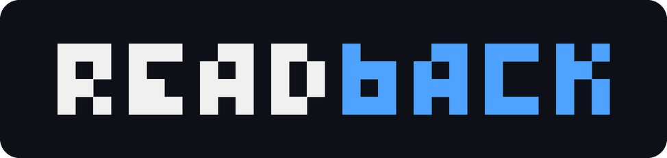
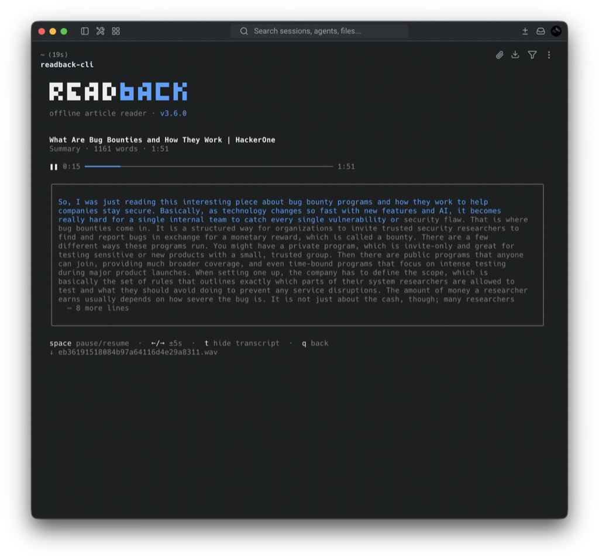
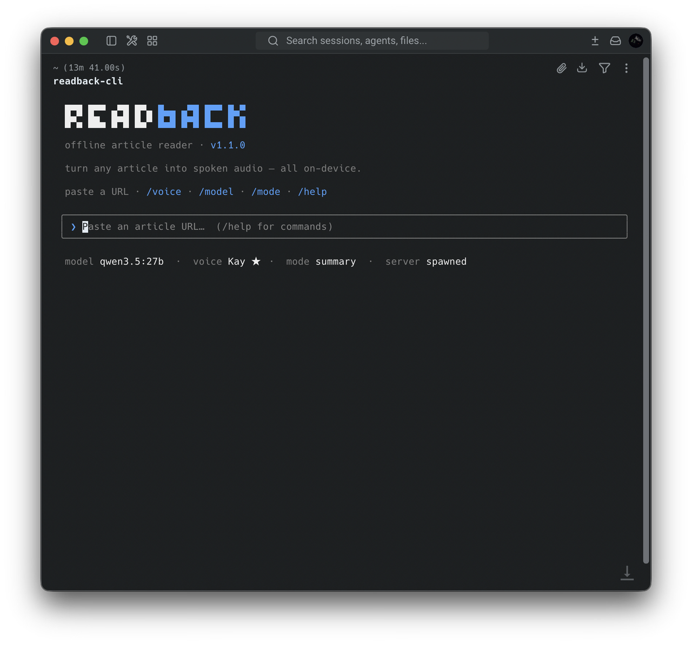
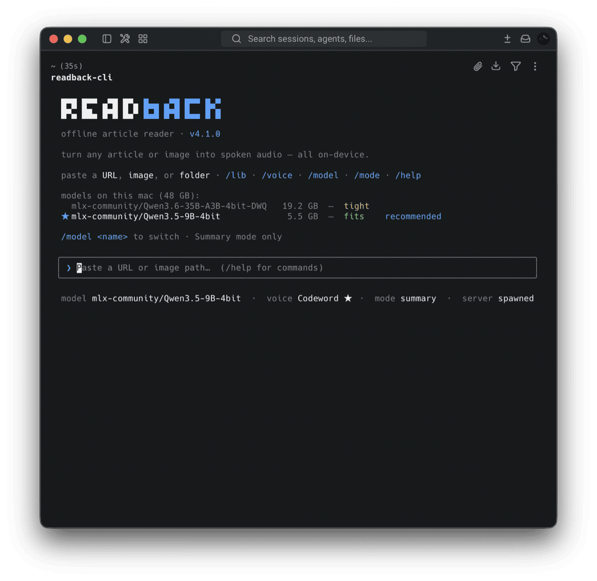
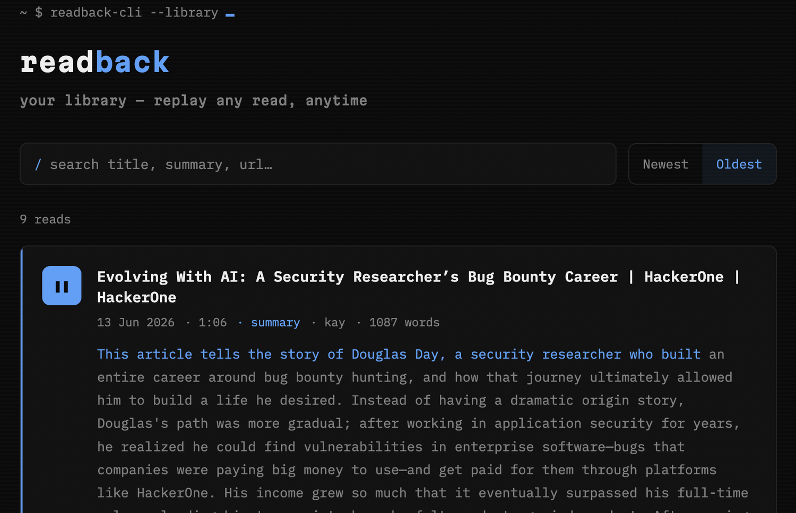

<p align="center">
  
</p>

<p align="center">
  <strong>Make reading interesting again.</strong><br>
  Paste a URL — get a clean, natural-voice reading of the whole article,<br>
  right in your terminal. Runs entirely on your Mac.<br>
  No cloud. No API keys. Nothing leaves your machine.
</p>

<p align="center">
  
  
  
</p>

<p align="center">
  
  
  
  
  
</p>

<p align="center">
  <sub>🤖 Built agent-first with Claude Code — <a href="docs/JOURNEY.md"><strong>read the devlog →</strong></a></sub>
</p>

<p align="center">
  <a href="https://mks-01.github.io/readback/">Landing page</a> ·
  <a href="#quick-start">Quick start</a> ·
  <a href="#how-it-works">How it works</a> ·
  <a href="#voices">Voices</a> ·
  <a href="#configuration">Config</a> ·
  <a href="#documentation">Docs</a> ·
  <a href="#roadmap">Roadmap</a>
</p>

<p align="center">
  <br>
  <sub>The terminal client mid-read: seekable player, live word-by-word transcript sync.</sub>
</p>

<p align="center">
  <strong>🔊 <a href="docs/media/sample-read.wav">Hear a sample read</a></strong><br>
  <sub>A real Summary-mode read (local LLM + CSM-1B) in <strong>kay</strong> — a custom-tuned clone voice</sub>
</p>

---

## Why I built this

I read a lot, but there's a whole pile of *good writing* I never get to — some
days I'd just rather listen than read another wall of text, so I built readback
to do exactly that. I've been tinkering with voice agents since college (2015), back when it
was a basic speech-to-text → text-to-speech loop held together with duct tape;
readback is that same itch leveled up — a local LLM and a neural voice (CSM-1B),
all on-device, no accounts, nothing phoning home. It lives in the terminal,
where it always felt most at home. Made to make reading interesting again.

---

## Quick start

readback is **terminal-first** — paste a URL, watch it synthesize, and audio
plays in your shell. The steps below get you running in under 5 minutes.

You need **macOS on Apple Silicon**, **Python 3.10–3.12**, [Bun](https://bun.sh/),
and [Ollama](https://ollama.ai/) (only for Summary mode). Developed on an **M5 Pro
— 18-core CPU, 20-core GPU, 48 GB**; synthesis speed scales with your GPU and
unified memory.

```bash
# 1. Ollama for Summary mode (skip if you only want Full mode)
ollama serve &                          # or launch the desktop app
ollama pull gemma4:26b                  # default; any chat model works

# 2. Install the server
git clone https://github.com/MKS-01/readback.git && cd readback
python3.11 -m venv .venv && source .venv/bin/activate
pip install -e .                        # csm-mlx is a git dep, pulled automatically

# 3. Build + install the terminal client → ~/.local/bin/readback-cli
cd src/cli && ./install.sh && cd ..

# 4. Read something
readback-cli                            # from anywhere; auto-starts the server
```

That's it — paste a URL, watch the progress, and the audio plays right in your
shell via `afplay`.

<p align="center">
  
</p>

The CLI auto-starts the `readback` server if one isn't already running, and
shuts it down on exit if it started it. A real terminal player: space = pause,
**←/→ = seek ±5 s**, t = transcript in Summary mode — with the spoken summary
**highlighting word by word in sync with the voice**. Slash commands `/voice`,
`/model` (pick the summary LLM from your local Ollama models, with a RAM-fit
check), `/mode`, `/help`, `/quit`. Same Ghost look, plus an Xcode-blue accent. macOS
only. Details: [`src/cli/README.md`](src/cli/README.md).

<p align="center">
  <br>
  <sub><code>/model</code> — every local Ollama model, sized up against your Mac's RAM before you commit.</sub>
</p>

On the **first read**, the CSM-1B weights (~6 GB) download from Hugging Face (no
login) and the MLX graph warms up — so the first synthesis is slow; later runs
are fast. See [SETUP.md](docs/SETUP.md) for verification, flags, and troubleshooting.

---

## Library dashboard

Generating a read is the heavy part — fetch, an optional LLM summary pass, and
CSM-1B synthesis all run on your Mac's GPU. But you pay that **once**: every read
is recorded in a small local SQLite library, and the dashboard lets you **replay
any past read anytime** — no LLM, no GPU, just the saved audio.

<p align="center">
  <br>
  <sub>The library dashboard mid-replay: search + sort, a seekable player, and the same word-by-word transcript highlight as the CLI.</sub>
</p>

- **Search** title / summary / URL and **sort** newest↔oldest.
- **Full player** on each card — click-to-seek bar, ±5 s skips, pause / resume /
  replay, and `space` + `←/→` keyboard shortcuts (the same keys as the CLI).
- **Synced transcript** — a Summary read highlights **word by word in blue** as it
  plays, identical to the terminal player.
- **Read the original** for further reading, or **delete** a read (removes its DB
  row *and* its WAV).

It's a lightweight **Vue 3** SPA — a pure REST + static client, no new Python at
read time, and the same Ghost design system (and fonts) as the CLI and landing
page.

```bash
cd src/dashboard && bun install && bun run build   # → dist/
readback                                            # then open http://127.0.0.1:8000/
```

Built `dist/` is served by the same `readback` process at `/`; for development,
`bun run dev` runs Vite on `:5173` and proxies to the server.

### Why generation stays on the CLI

The LLM summary is a **heavy, occasional task** — you don't re-summarize an
article every time you want to *hear* it, and the model work (a local LLM plus
neural TTS) wants your Mac's GPU and unified memory. So readback deliberately
splits the two halves:

- **Generate on demand**, from the terminal — the CLI drives the LLM + CSM
  pipeline on the Mac. This is the part that costs RAM and GPU, and it runs only
  when you actually want a new read.
- **Replay anywhere**, from the dashboard — which never touches the LLM or TTS; it
  only lists rows and serves a finished WAV, so it stays tiny and fast.

That separation is also what keeps a future split deploy clean: the audio lives
on the Mac (the DB stores each WAV's absolute path), so a home-server /
[Pi](https://github.com/MKS-01/pizow) can host the lightweight UI while the Mac
stays the generation brain. Details: [`src/dashboard/README.md`](src/dashboard/README.md).

---

## How it works

The terminal CLI talks to a local Python server over WebSocket — the same
pipeline whether you're reading a news piece or a 10,000-word essay.

```
              ┌─────────────────────┐
              │      CLI mode       │
              │      Bun + Ink      │
              │   afplay  player    │
              └──────────┬──────────┘
                         │ auto-spawns the
                         │ server if needed
                         │  WebSocket  /ws
                         ▼
          ┌──────────────────────────────┐
          │   readback server (FastAPI)  │
          │                              │
          │  fetch ▸ extract ▸ [summary] │
          │   ▸ chunk ▸ TTS ▸ WAV        │
          └──────┬────────────────┬──────┘
                 ▼                ▼
        ┌─────────────────┐ ┌─────────────────┐
        │  Ollama (local) │ │ CSM-1B on MLX / │
        │  Summary mode   │ │ Metal — offline │
        │  only           │ │ voice synthesis │
        └─────────────────┘ └─────────────────┘
```

The read pipeline, left to right:

1. **Extract** — `trafilatura` pulls the article body (browser-UA fallback for sites that 403), then light scrubbing removes URLs and citation markers so they aren't read aloud.
2. **Summarize** (Summary mode only) — one call to the local LLM via Ollama rewrites the article as a spoken explanation. Full mode skips this entirely — no LLM involved.
3. **Chunk + synthesize** — the text is split into sentence-aware chunks, each synthesized with CSM-1B, silence-trimmed, and joined with small gaps.
4. **Serve** — the finished WAV is served over HTTP to whichever client asked; progress streams live over the WebSocket while it's being made.

CSM runs on one MLX/Metal thread (MLX binds its GPU stream to the first thread
that touches it), so read jobs queue naturally. The CLI is a pure client — it
adds zero server code, just spawns and supervises the same `readback` process
you'd start by hand. A second, lighter client — the [library
dashboard](#library-dashboard) — replays *past* reads over plain REST (no
WebSocket, no models), so generating and listening-again are cleanly separate.
See [ARCHITECTURE.md](docs/ARCHITECTURE.md) for the full system view.

---

## Tech stack

| Layer | Technology |
|---|---|
| **Extraction** | [trafilatura](https://trafilatura.readthedocs.io/) — URL → clean text (+ browser-UA fallback) |
| **Summary (optional)** | [Ollama](https://ollama.ai/) — default `gemma4:26b`; any pulled chat model works |
| **TTS** | [CSM-1B](https://huggingface.co/senstella/csm-1b-mlx) (Sesame) via [csm-mlx](https://github.com/senstella/csm-mlx) — MLX/Metal, 24 kHz, fp32 |
| **Voices** | 2 built-in reading voices + **clone any voice from a short clip** + optional **LoRA fine-tuning** |
| **Server** | [FastAPI](https://fastapi.tiangolo.com/) + WebSocket — streams progress, serves the WAV, REST library |
| **CLI client** | Bun + TypeScript + [Ink](https://github.com/vadimdemedes/ink) — terminal UI, `afplay` playback |
| **Dashboard** | [Vue 3](https://vuejs.org/) + [Vite](https://vite.dev/) + TS — replay past reads (search/sort/player); stdlib SQLite library |

---

## Voices

readback's voice comes from a short **reference clip** that CSM conditions on —
the clip's timbre, age, and accent are what you hear.

- **Built-in** — `conversational_a` (female ★) / `conversational_b` (male), an even literary reading tone. English-best.
- **Clone** — drop a clean 5–8 s mono clip into `src/voice/` and register it under `tts.csm.voices` (the bundled config ships a sample `kay` voice):

  ```yaml
  tts:
    csm:
      speaker: "kay"          # default voice = the name below
      temperature: 0.6        # delivery: lower = composed, higher = livelier
      voices:
        - name: "kay"
          label: "Kay ★"
          wav: "src/voice/voice_kay_long.wav"             # relative to config.yaml
          speaker: 0
          ref_text: "Exact transcript of the clip."   # MUST match the audio
  ```

  `ref_text` **must** be the clip's exact transcript — a mismatched pair garbles
  the voice. `temperature` tunes *delivery*, not *who* it sounds like.

- **Fine-tune** (optional) — for higher fidelity with more audio there's a LoRA pipeline in [`src/finetune/`](src/finetune/README.md); point `tts.csm.lora_path` at the trained adapter.

Full clone/tune procedure: `.claude/skills/csm-voice`.

---

## Configuration

Edit `config.yaml` (or pass `--config path`). The defaults work out of the box.

| Key | What | Default |
|---|---|---|
| `ollama.model` | Ollama model for Summary mode | `gemma4:26b` |
| `ollama.host` | Ollama endpoint | `http://localhost:11434` |
| `tts.csm.speaker` | Active voice (`conversational_a`/`_b` or a clone `name`) | `kay` |
| `tts.csm.precision` | `bf16` (clean+fast) / `fp16` / `fp32` (slowest, cleanest) | `fp32` |
| `tts.csm.temperature` | Delivery: lower = composed, higher = livelier | `0.6` |
| `tts.csm.voices` | Clone voices (`name`, `label`, `wav`, `ref_text`, `speaker`) | sample `kay` |
| `tts.csm.lora_path` | LoRA adapter dir from a `csm-mlx finetune` run | `null` |
| `reader.default_mode` | `full` (verbatim) or `summary` (LLM) | `full` |
| `reader.output_dir` | Where generated WAVs are written/served | `~/.readback/reader` |
| `reader.gap_sec` | Silence inserted between synthesized chunks | `0.18` |
| `reader.summary_max_chars` | Cap article text fed to the LLM in Summary mode | `16000` |
| `reader.library_db` | SQLite library of past reads (powers the dashboard) | `~/Desktop/C0D3/readback-audio-db/library.db` |

Server flags: `readback --model <ollama-model>`, `--host`, `--port`, `--config`.

**LAN access:** `readback --host 0.0.0.0` exposes the server on your local network; the startup banner prints the network URL.

---

## Documentation

Everything beyond this README lives in [`docs/`](docs/):

| Doc | What's inside |
|---|---|
| [`docs/SETUP.md`](docs/SETUP.md) | End-to-end setup, flags, verification, troubleshooting |
| [`docs/ARCHITECTURE.md`](docs/ARCHITECTURE.md) | System view — pipeline, concurrency model, WS protocol, extension points |
| [`docs/PLAN.md`](docs/PLAN.md) | Planning history — every feature/refactor plan with status, newest first |
| [`docs/JOURNEY.md`](docs/JOURNEY.md) | Devlog — how readback was built agent-first (the pivots, decisions, gotchas) |
| [`src/cli/README.md`](src/cli/README.md) | Terminal client — keys, slash commands, player internals |
| [`src/dashboard/README.md`](src/dashboard/README.md) | Web dashboard — library UI (Vue 3), dev/build/deploy |
| [`src/finetune/README.md`](src/finetune/README.md) | LoRA voice fine-tune pipeline (data prep → training → config) |

---

## Roadmap

- [x] **Model switch (CLI)** — `/model` picks the summary LLM at runtime, with a RAM-fit check (v1.1.0)
- [ ] **More voice options** — grow the voice menu beyond the two built-ins + `kay` (incl. A/B-ing the built-in read-speech references and exposing more of them)
- [ ] **Voice tuning from the CLI** — clone a new voice (clip → transcript → register) from `readback-cli` instead of editing `config.yaml`
- [ ] **Faster synthesis** — reduce conversion time; ultimately bounded by your Mac's GPU / unified memory, so tune the controllable knobs (precision, chunking, warm-up)

**Audio quality**

- [ ] Loudness-normalize the final WAV to a consistent target (e.g. −1 dBFS) — levels currently vary with voice and chunk
- [ ] Degenerate-chunk guard — a chunk that synthesizes to all-silence is silently dropped (`_tidy_silence` returns empty → content loss); detect + retry once
- [x] Temperature / chunk-size tuning — shipped 2026-06-10: `temperature 0.6`, `fp32`, 280-char sentence-aware chunks; the next quality jump is the LoRA fine-tune (deferred, see `src/finetune/`)
- [ ] Light crossfade at chunk joins to remove residual seams (chunks are joined with a flat 0.18 s gap)

**UI**

- [ ] Extracted-article preview (title + word count + est. listen time) before synthesizing — both clients currently show only the phase until `done`
- [ ] Progress: % + estimated time remaining (both clients already show a per-chunk bar; the CLI shows done/total)
- [ ] Download filename = sanitized article title (the WAV is served/saved as a uuid)
- [x] **History of recent reads** — the [library dashboard](#library-dashboard) lists/searches/replays every past read, backed by the saved WAVs (a SQLite library; 2026-06-13)
- [ ] Nicer error states (paywalled / JS-only / fetch-blocked pages)

**Housekeeping & nice-to-have**

- [ ] Generated-WAV *auto*-rotation — `~/.readback/reader/` grows unbounded; keep N most-recent / age-out (the dashboard already supports manual delete, which removes the row + WAV)
- [ ] Cache by (url, mode, voice) so re-reading is instant
- [ ] Chunked summarization for very long articles (Summary mode truncates to `summary_max_chars`)
- [ ] Paste raw text (not just a URL) as an input source

Ideas and PRs welcome — open an issue.

---

## License

MIT — see [LICENSE](LICENSE).
