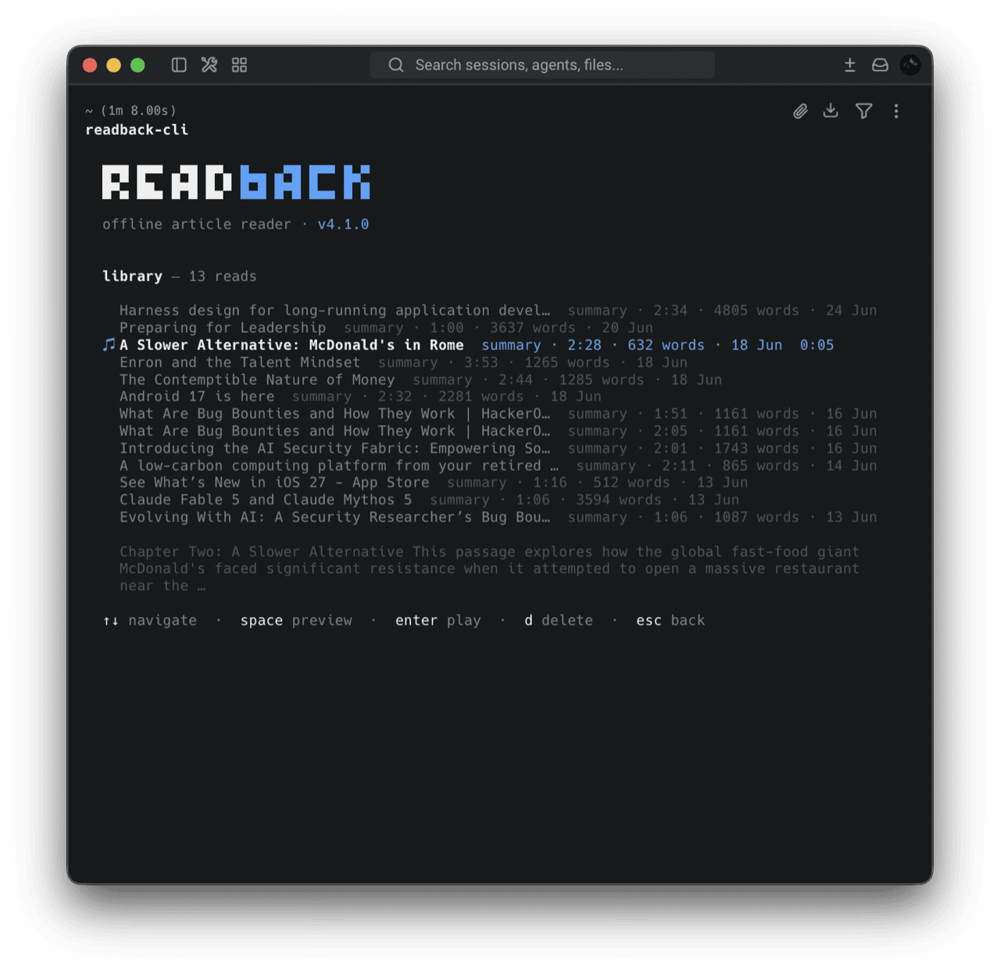
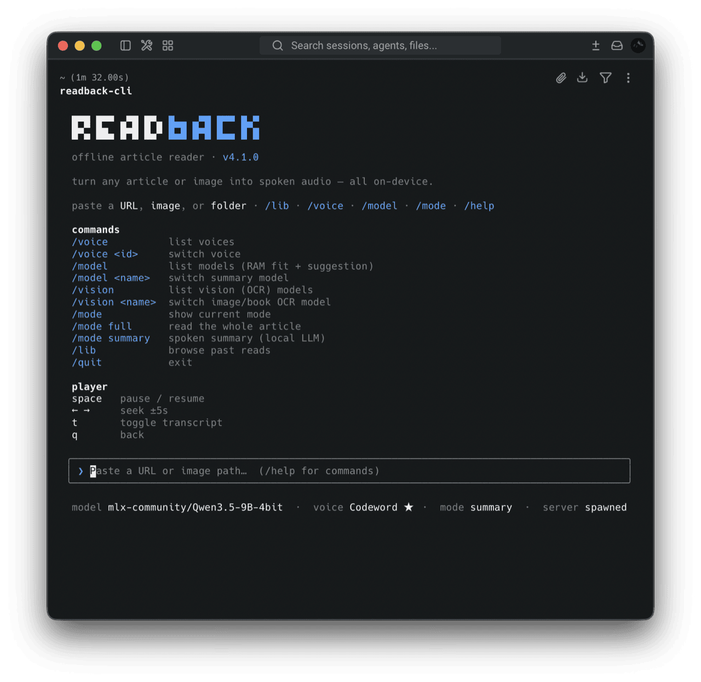
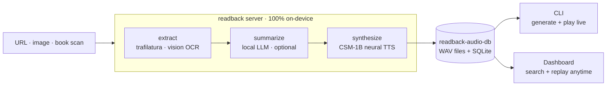
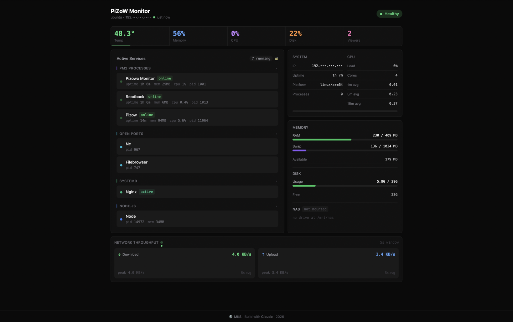
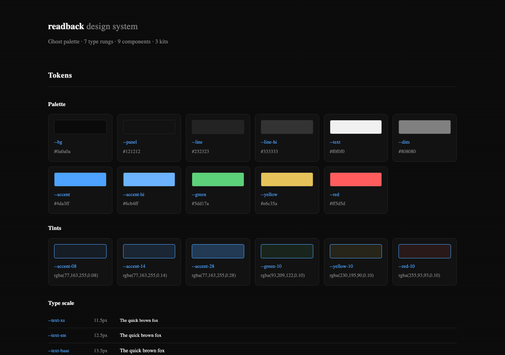

<p align="center">
  
</p>

<p align="center">
  <strong>Paste a URL or snap a book — hear it read aloud by a neural voice, entirely on your Mac.</strong><br>
  No cloud. No API keys. Nothing leaves your machine.
</p>

<p align="center">
  
  
  
</p>

<p align="center">
  <a href="https://github.com/MKS-01/readback/actions/workflows/ci.yml"></a>
</p>

<p align="center">
  
  
  
  
  
  
  
  
  
</p>

<p align="center">
  <a href="https://mks-01.github.io/readback/">Landing page</a> ·
  <a href="#getting-started">Getting started</a> ·
  <a href="#how-it-works">How it works</a> ·
  <a href="#voices">Voices</a> ·
  <a href="#configuration">Config</a> ·
  <a href="#pi-deployment">Pi deploy</a> ·
  <a href="#design-system">Design system</a> ·
  <a href="docs/ROADMAP.md">Roadmap</a>
</p>

<p align="center">
  <br>
  <sub>The terminal client mid-read: seekable player, live word-by-word transcript sync.</sub>
</p>

<p align="center">
  <strong>🔊 <a href="docs/media/sample-read.wav">Hear a sample read</a></strong><br>
  <sub>A real Summary-mode read (local LLM + CSM-1B) in <strong>codeword</strong> — a custom-tuned clone voice</sub>
</p>

---

## Getting started

> **Requires macOS on Apple Silicon (M1–M5).** CSM-1B runs on MLX/Metal. Speed scales with GPU cores and unified memory.

**First time? One command sets it all up:**

```bash
git clone https://github.com/MKS-01/readback.git && cd readback
bash scripts/setup.sh
```

`setup.sh` is idempotent — safe to re-run. It checks platform, creates `.venv`, installs readback + CLI + dashboard, and optionally pulls the Ollama model and CSM-1B weights (~6 GB).

Needs [Bun](https://bun.sh/) and [Ollama](https://ollama.ai/) (for Summary mode) — the script tells you if either is missing. Then:

```bash
readback-cli            # from anywhere; auto-starts the server
```

Paste a URL → audio plays in your shell.

<details>
<summary><strong>Prefer to set it up by hand?</strong></summary>

```bash
# 1. Ollama for Summary mode (skip if you only want Full mode)
ollama serve &                          # or launch the desktop app
ollama pull qwen3.5:9b                  # default; any chat model works

# 2. Install the server
git clone https://github.com/MKS-01/readback.git && cd readback
python3.11 -m venv .venv && source .venv/bin/activate
pip install -e .                        # csm-mlx is a git dep, pulled automatically

# 3. Build + install the terminal client → ~/.local/bin/readback-cli
cd src/cli && ./install.sh && cd ..

# 4. Read something
readback-cli                            # from anywhere; auto-starts the server
```
</details>

<p align="center">
  
</p>

The CLI auto-starts the server and kills it on exit. It's a full terminal player:

- **space** pause, **←/→** seek ±5 s, **t** toggle transcript (word-by-word highlight synced to the voice)
- `/voice`, `/model` (RAM-fit check), `/mode`, `/lib` (browse + replay past reads), `/help`
- `q` to quit (or any time the input field is empty)

macOS only (`afplay` playback). Details: [`src/cli/README.md`](src/cli/README.md).

<p align="center">
  <br>
  <sub><code>/model</code> — every local Ollama model, sized up against your Mac's RAM before you commit.</sub>
</p>

<p align="center">
  <br>
  <sub><code>/lib</code> — browse past reads; metadata and a summary preview appear for the selected item.</sub>
</p>

<p align="center">
  <br>
  <sub><code>/help</code> — every command and player key at a glance.</sub>
</p>

First read downloads CSM-1B weights (~6 GB) and warms up the MLX graph — slow once, fast after. See [SETUP.md](docs/SETUP.md) for details.

---

## Library dashboard

Every read is saved to a local SQLite library. The dashboard lets you **replay any past read** — no LLM, no GPU, just the saved audio.

<p align="center">
  <br>
  <sub>Search, sort, and replay past reads — seekable player + word-by-word transcript highlight.</sub>
</p>

- **Search** title / summary / URL, **sort** newest↔oldest, **paginate** 20 at a time
- **Full player** per card — click-to-seek, ±5 s skip, `space` + `←/→` keyboard shortcuts
- **Synced transcript** — word-by-word highlight in blue, same as the CLI
- **Delete** removes the DB row *and* its WAV

A lightweight **Vue 3** SPA (pure REST client). Built `dist/` is served at `/` by the same `readback` process; `bun run dev` runs Vite on `:5173` for development. Details: [`src/dashboard/README.md`](src/dashboard/README.md).

Generation stays on the CLI (Mac GPU) — the dashboard only replays. This split also enables [Pi deployment](#pi-deployment): the Mac generates, a home Pi serves the library.

---

## How it works



1. **Extract** — `trafilatura` pulls article text (browser-UA fallback for 403s). Images/book scans → Ollama vision OCR. Folders/globs → multi-page: OCR'd in filename order and stitched into one document.
2. **Summarize** *(optional)* — local LLM rewrites it as a spoken explanation. Full mode skips this entirely.
3. **Synthesize** — sentence-aware chunks → CSM-1B → silence-trimmed → joined with small gaps.
4. **Serve** — WAV over HTTP; progress streams live over the WebSocket.

**Source-aware tone** — a URL reads as a livelier article explainer; a book scan reads calmer, opening by naming the chapter. Automatic, nothing to set. Long scans **map-reduce** instead of truncating.

See [ARCHITECTURE.md](docs/ARCHITECTURE.md) for the full system view.

---

## Tech stack

| Layer | Technology |
|---|---|
| **Extraction** | [trafilatura](https://trafilatura.readthedocs.io/) — URL → clean text (+ browser-UA fallback); **Ollama vision OCR** for images / book scans |
| **Summary (optional)** | [Ollama](https://ollama.ai/) — default `qwen3.5:9b`; any pulled chat model works |
| **TTS** | [CSM-1B](https://huggingface.co/senstella/csm-1b-mlx) (Sesame) via [csm-mlx](https://github.com/senstella/csm-mlx) — MLX/Metal, 24 kHz, fp32 |
| **Voices** | 2 built-in reading voices + **clone any voice from a short clip** + optional **LoRA fine-tuning** |
| **Server** | [FastAPI](https://fastapi.tiangolo.com/) + WebSocket — streams progress, serves the WAV, REST library |
| **CLI client** | Bun + TypeScript + [Ink](https://github.com/vadimdemedes/ink) — terminal UI, `afplay` playback |
| **Dashboard** | [Vue 3](https://vuejs.org/) + [Vite](https://vite.dev/) + TS — replay past reads (search/sort/player); stdlib SQLite library |

---

## Voices

CSM conditions on a short reference clip — the clip's timbre and accent are what you hear.

- **Built-in** — `conversational_a` (female ★) / `conversational_b` (male)
- **Clone** — 5–8 s mono clip + exact transcript in `config.yaml`:

  ```yaml
  tts:
    csm:
      speaker: "codeword"
      temperature: 0.7          # delivery: lower = composed, higher = livelier
      voices:
        - name: "codeword"
          label: "Codeword ★"
          wav: "src/voice/voice_codeword.wav"
          speaker: 0
          ref_text: "Exact transcript of the clip."   # MUST match the audio
  ```

- **LoRA fine-tune** — for higher fidelity with more audio: [`src/finetune/`](src/finetune/README.md)

---

## Configuration

Edit `config.yaml` (or pass `--config path`). The defaults work out of the box.

| Key | What | Default |
|---|---|---|
| `ollama.model` | Ollama model for Summary mode | `qwen3.5:9b` |
| `ollama.host` | Ollama endpoint | `http://localhost:11434` |
| `tts.csm.speaker` | Active voice (`conversational_a`/`_b` or a clone `name`) | `codeword` |
| `tts.csm.precision` | `bf16` (clean+fast) / `fp16` / `fp32` (slowest, cleanest) | `fp32` |
| `tts.csm.temperature` | Delivery: lower = composed, higher = livelier | `0.7` |
| `tts.csm.voices` | Clone voices (`name`, `label`, `wav`, `ref_text`, `speaker`) | sample `codeword` |
| `tts.csm.lora_path` | LoRA adapter dir from a `csm-mlx finetune` run | `null` |
| `reader.default_mode` | `full` (verbatim) or `summary` (LLM) | `full` |
| `reader.output_dir` | Where generated WAVs are written/served (a `readback-audio-db/` folder beside the repo) | `../readback-audio-db/audio` |
| `reader.gap_sec` | Silence inserted between synthesized chunks | `0.18` |
| `reader.summary_max_chars` | Per-pass chunk size for Summary mode — longer inputs (book scans) are map-reduced across batches of this size, not truncated | `16000` |
| `reader.library_db` | SQLite library of past reads (powers the dashboard) | `../readback-audio-db/library.db` |

Audio + library DB default to a **`readback-audio-db/`** folder beside the repo. Point `output_dir` / `library_db` anywhere (absolute or `~` both work).

**Flags:** `readback --model <name>`, `--host`, `--port`, `--config`. Use `--host 0.0.0.0` for LAN access.

---

## Pi deployment

Generation stays on the Mac (CSM-1B + Ollama need Apple Silicon). A Raspberry Pi runs the lightweight read-only server — library REST, Vue dashboard, and audio serving — so your reads are accessible from **any browser on the network**.

The Pi runs readback under [PiZoW](https://github.com/MKS-01/pizow) (PM2, survives reboots, ~68 MB).

<p align="center">
  <br>
  <sub>PiZoW Monitor — Readback online at 6 MB alongside the other Pi services.</sub>
</p>

```bash
# one-time setup
cp .env.example .env              # fill in PI_USER, PI_HOST, PI_PATH
bash scripts/deploy-pi.sh        # build dashboard → rsync → venv + pip → PM2
ssh PI_USER@PI_HOST "pm2 startup && pm2 save"   # survive reboots

# after each new read on Mac
bash scripts/sync-pi.sh          # incremental — only new WAVs since last sync
bash scripts/sync-pi.sh --full   # or full sync (cleans orphans on Pi)
```

Dashboard is live at `http://<PI_HOST>:8090`.

---

## Design system

The Ghost palette, type scale, and every UI component — documented as live specimens you can browse locally.

<p align="center">
  <br>
  <sub>Color tokens, tints, type scale, spacing, and motion — the foundation every surface is built on.</sub>
</p>

**7 type rungs** · **9 components** (Badge, Button, PromptLine, SearchInput, SeekBar, WaveformPlayer, ReadCard, Wordmark, SectionHeader) · **3 UI kits** (Terminal, Dashboard, Landing) — all interactive.

```bash
cd src/design-system && python3 -m http.server 8111
# open http://localhost:8111
```

Canonical tokens live in `src/design-system/tokens/` — the dashboard imports them via `@import`; the landing page inlines the same values (deployed standalone). The CLI mirrors the palette in `src/cli/src/theme.ts`.

---

## Documentation

| Doc | What's inside |
|---|---|
| [`docs/SETUP.md`](docs/SETUP.md) | Setup, flags, troubleshooting |
| [`docs/ARCHITECTURE.md`](docs/ARCHITECTURE.md) | Pipeline, concurrency, WS protocol |
| [`docs/ROADMAP.md`](docs/ROADMAP.md) | What's planned and recently shipped |
| [`docs/JOURNEY.md`](docs/JOURNEY.md) | Devlog — built agent-first with Claude Code |
| [`src/cli/README.md`](src/cli/README.md) | Terminal client internals |
| [`src/dashboard/README.md`](src/dashboard/README.md) | Web dashboard (Vue 3) |
| [`src/finetune/README.md`](src/finetune/README.md) | LoRA voice fine-tuning |

---

## License

MIT — see [LICENSE](LICENSE).

<p align="center">
  <sub>Built agent-first with <a href="https://claude.ai/code">Claude Code</a> — <a href="docs/JOURNEY.md">read the devlog →</a></sub>
</p>
