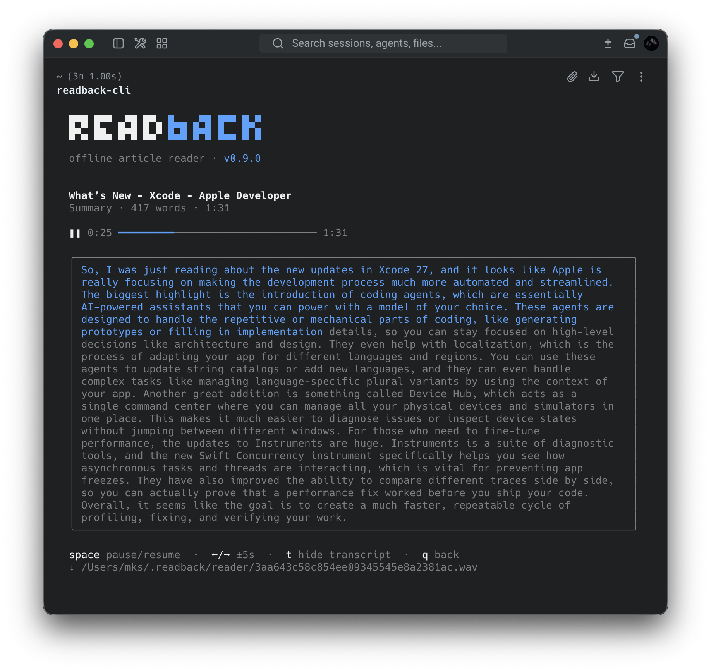
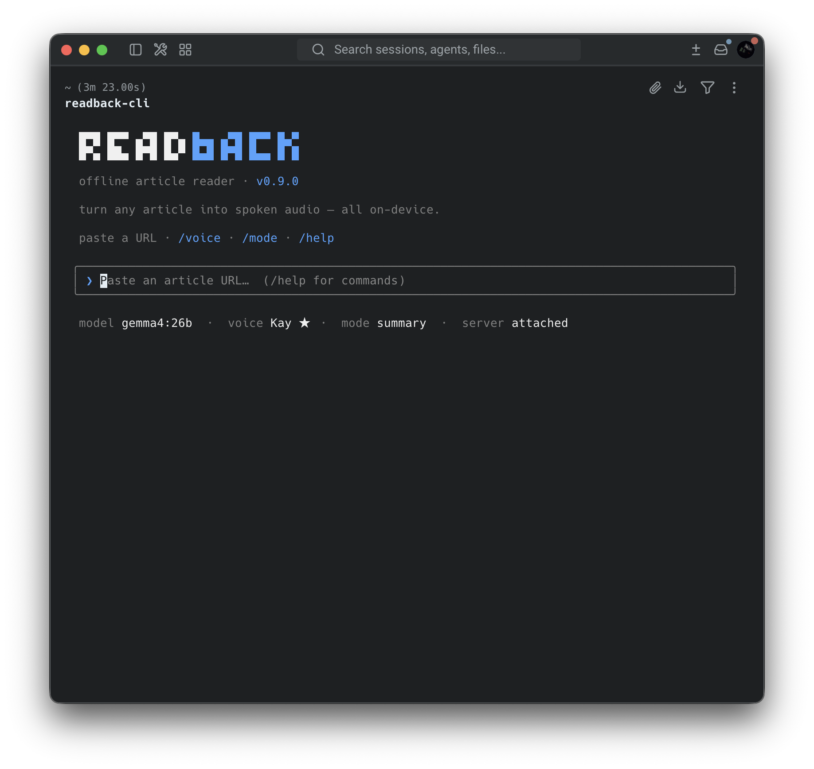

<h1 align="center">📖 readback</h1>

<p align="center">
  <strong>Turn any article into a podcast — entirely on your Mac.</strong><br>
  Paste a URL. Get a clean, natural-voice reading of the whole piece —<br>
  in the browser or right in your terminal. No cloud. No API keys.<br>
  Nothing leaves your machine.
</p>

<p align="center">
  
  
  
</p>

<p align="center">
  
  
  
  
  
</p>

<p align="center">
  
</p>

<p align="center">
  <sub>The terminal client mid-read: seekable player, live word-by-word transcript sync.</sub>
</p>

<details align="center">
  <summary><strong>🖥 More screens — the web app</strong></summary>
  <p align="center">
    <br>
    <sub>The browser UI — three.js orb, custom player, same Ghost theme.</sub>
  </p>
</details>

<p align="center">
  <strong>🔊 <a href="media/sample-read.wav">Hear a sample read</a></strong><br>
  <sub>Sample voice: <strong>kay</strong> — a custom-tuned clone voice on CSM-1B</sub>
</p>

---

## What it does

1. **Paste a URL.** readback extracts the clean article text — no nav, ads, or boilerplate.
2. **Pick a mode.** *Full* reads it verbatim; *Summary* has a local LLM turn it into a tight spoken explanation first.
3. **Listen.** It's synthesized offline with **CSM-1B** and played where you are — a minimalist browser player or a terminal player — or downloaded as a WAV.

Because there's no live conversation to keep up with, readback synthesizes the
**whole piece up front**, then hands back one gapless audio file — so voice
quality wins over latency.

---

## Quick start

There are **two ways to use readback** — same server, same audio, pick your
surface:

- **Web mode** — a browser UI with the orb, the custom player, and download.
- **CLI mode** — a terminal UI (Bun + Ink) that auto-starts the server and
  plays the audio right in your shell.

Either way, install the server first. You need **macOS on Apple Silicon**,
**Python 3.10–3.12**, **Node 18+**, and [Ollama](https://ollama.ai/) (only for
Summary mode). Developed and tested on a **MBP 14 M5 Pro 18-core
CPU, 20-core GPU, 48 GB unified memory**; synthesis speed scales
with your GPU and unified memory.

```bash
# 1. Ollama for Summary mode (skip if you only want Full mode)
ollama serve &                          # or launch the desktop app
ollama pull gemma4:26b                  # default; any chat model works

# 2. Install the server
git clone https://github.com/MKS-01/readback.git && cd readback
python3.11 -m venv .venv && source .venv/bin/activate
pip install -e .                        # csm-mlx is a git dep, pulled automatically

# 3. Build the web UI (one-time; rerun after editing readback/web/frontend/)
cd readback/web/frontend && npm install && npm run build && cd ../../..

# 4. Run — web mode
readback                                # open http://127.0.0.1:8000
```

On the **first read**, the CSM-1B weights (~6 GB) download from Hugging Face (no
login) and the MLX graph warms up — so the first synthesis is slow; later runs
are fast. See [SETUP.md](SETUP.md) for verification, flags, and troubleshooting.

---

## CLI mode

Prefer to stay in the terminal? The CLI is a second client of the same server —
paste a URL, watch the progress, and the audio plays right there via `afplay`.

<p align="center">
  
</p>

```bash
cd cli && ./install.sh          # builds a standalone binary → ~/.local/bin/readback-cli
readback-cli                    # from anywhere; auto-starts the server
```

One-command install (needs [Bun](https://bun.sh/), this mode only); it
auto-starts the `readback` server if one isn't already running and shuts it
down on exit if it started it. Slash commands (`/voice`, `/mode`, `/help`,
`/quit`) and a real terminal player: space = pause, **←/→ = seek ±5 s**, t =
transcript in Summary mode — with the spoken summary **highlighting word by
word in sync with the voice**. Same Ghost look, plus an Xcode-blue accent.
macOS only. Details: [`cli/README.md`](cli/README.md).

---

## How it works

One local server, two clients. Everything below the WebSocket line is a single
Python process on your Mac; both UIs are thin clients of the same `/ws`
protocol — same phases, same progress stream, same finished WAV.

```
   ┌─────────────────────┐        ┌─────────────────────┐
   │      Web mode       │        │      CLI mode       │
   │  React + three.js   │        │      Bun + Ink      │
   │  in-browser player  │        │   afplay  player    │
   └──────────┬──────────┘        └──────────┬──────────┘
              │                              │ auto-spawns the
              │       WebSocket  /ws         │ server if needed
              └──────────────┬───────────────┘
                             ▼
              ┌──────────────────────────────┐
              │   readback server (FastAPI)  │
              │                              │
              │  fetch ▸ extract ▸ [summary] │
              │   ▸ chunk ▸ TTS ▸ WAV        │
              └──────┬────────────────┬──────┘
                     ▼                ▼
            ┌─────────────────┐ ┌─────────────────┐
            │  Ollama (local) │ │ CSM-1B on MLX / │
            │  Summary mode   │ │ Metal — offline │
            │  only           │ │ voice synthesis │
            └─────────────────┘ └─────────────────┘
```

The read pipeline, left to right:

1. **Extract** — `trafilatura` pulls the article body (browser-UA fallback for sites that 403), then light scrubbing removes URLs and citation markers so they aren't read aloud.
2. **Summarize** (Summary mode only) — one call to the local LLM via Ollama rewrites the article as a spoken explanation. Full mode skips this entirely — no LLM involved.
3. **Chunk + synthesize** — the text is split into sentence-aware chunks, each synthesized with CSM-1B, silence-trimmed, and joined with small gaps.
4. **Serve** — the finished WAV is served over HTTP to whichever client asked; progress streams live over the WebSocket while it's being made.

CSM runs on one MLX/Metal thread (MLX binds its GPU stream to the first thread
that touches it), so read jobs queue naturally. The CLI is a pure client — it
adds zero server code, just spawns and supervises the same `readback` process
you'd start by hand. See [ARCHITECTURE.md](ARCHITECTURE.md) for the full
system view.

---

## Tech stack

| Layer | Technology |
|---|---|
| **Extraction** | [trafilatura](https://trafilatura.readthedocs.io/) — URL → clean text (+ browser-UA fallback) |
| **Summary (optional)** | [Ollama](https://ollama.ai/) — default `gemma4:26b`; any pulled chat model works |
| **TTS** | [CSM-1B](https://huggingface.co/senstella/csm-1b-mlx) (Sesame) via [csm-mlx](https://github.com/senstella/csm-mlx) — MLX/Metal, 24 kHz, fp32 |
| **Voices** | 2 built-in reading voices + **clone any voice from a short clip** + optional **LoRA fine-tuning** |
| **Server** | [FastAPI](https://fastapi.tiangolo.com/) + WebSocket — streams progress, serves the WAV |
| **Web client** | React 18 + TypeScript + Vite + zustand — three.js orb, custom audio player, dark "Ghost" theme |
| **CLI client (optional)** | Bun + TypeScript + [Ink](https://github.com/vadimdemedes/ink) — second client of the same WebSocket, `afplay` playback |

---

## Voices

readback's voice comes from a short **reference clip** that CSM conditions on —
the clip's timbre, age, and accent are what you hear.

- **Built-in** — `conversational_a` (female ★) / `conversational_b` (male), an even literary reading tone. English-best.
- **Clone** — drop a clean 5–8 s mono clip into `voice/` and register it under `tts.csm.voices` (the bundled config ships a sample `kay` voice):

  ```yaml
  tts:
    csm:
      speaker: "kay"          # default voice = the name below
      temperature: 0.6        # delivery: lower = composed, higher = livelier
      voices:
        - name: "kay"
          label: "Kay ★"
          wav: "voice/k.wav"                          # relative to config.yaml
          speaker: 0
          ref_text: "Exact transcript of the clip."   # MUST match the audio
  ```

  `ref_text` **must** be the clip's exact transcript — a mismatched pair garbles
  the voice. `temperature` tunes *delivery*, not *who* it sounds like.

- **Fine-tune** (optional) — for higher fidelity with more audio there's a LoRA pipeline in [`finetune/`](finetune/README.md); point `tts.csm.lora_path` at the trained adapter.

Full clone/tune procedure: `.claude/skills/csm-voice`.

---

## Configuration

Edit `config.yaml` (or pass `--config path`). The defaults work out of the box.

| Key | What | Default |
|---|---|---|
| `ollama.model` | Ollama model for Summary mode | `gemma4:26b` |
| `ollama.host` | Ollama endpoint | `http://localhost:11434` |
| `tts.csm.speaker` | Active voice (`conversational_a`/`_b` or a clone `name`) | `kay` |
| `tts.csm.precision` | `bf16` (clean+fast) / `fp16` / `fp32` (slowest, cleanest) | `fp32` |
| `tts.csm.temperature` | Delivery: lower = composed, higher = livelier | `0.6` |
| `tts.csm.voices` | Clone voices (`name`, `label`, `wav`, `ref_text`, `speaker`) | sample `kay` |
| `tts.csm.lora_path` | LoRA adapter dir from a `csm-mlx finetune` run | `null` |
| `reader.default_mode` | `full` (verbatim) or `summary` (LLM) | `full` |
| `reader.output_dir` | Where generated WAVs are written/served | `~/.readback/reader` |
| `reader.gap_sec` | Silence inserted between synthesized chunks | `0.18` |
| `reader.summary_max_chars` | Cap article text fed to the LLM in Summary mode | `16000` |

Server flags: `readback --model <ollama-model>`, `--host`, `--port`, `--config`.

**LAN access (phone/tablet):** `readback --host 0.0.0.0 --auto-cert` serves over
HTTPS; the startup banner prints the network URL, cert fingerprint, and a
`/cert.pem` link to trust once per device.

---

## Roadmap

- [ ] **Model switch** — change the summary LLM from the clients at runtime (no config edit + restart)
- [ ] **More voice options** — grow the voice menu beyond the two built-ins + `kay`
- [ ] **Voice tuning from the CLI** — clone a new voice (clip → transcript → register) from `readback-cli` instead of editing `config.yaml`
- [ ] **Faster synthesis** — reduce conversion time; ultimately bounded by your Mac's GPU / unified memory, so tune the controllable knobs (precision, chunking, warm-up)

Ideas and PRs welcome — open an issue.

---

## License

MIT — see [LICENSE](LICENSE).
