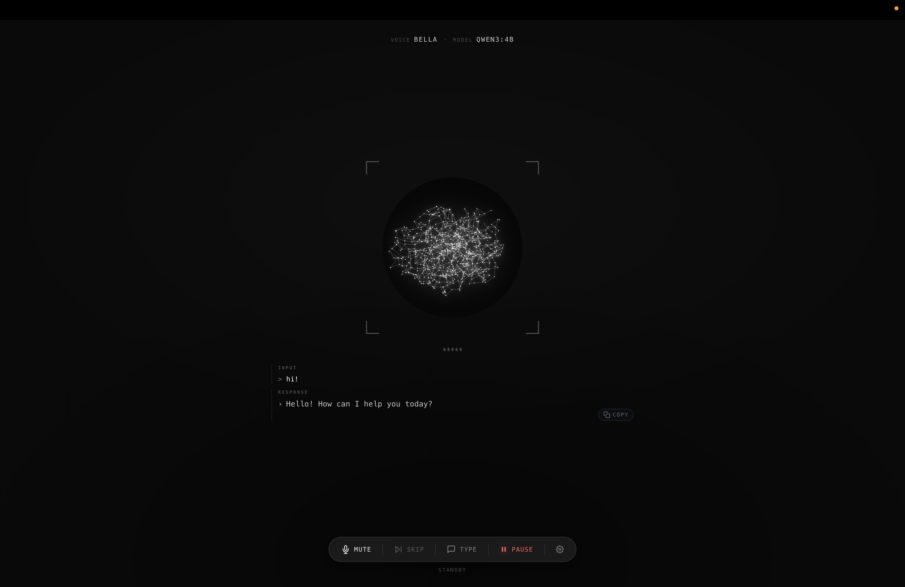
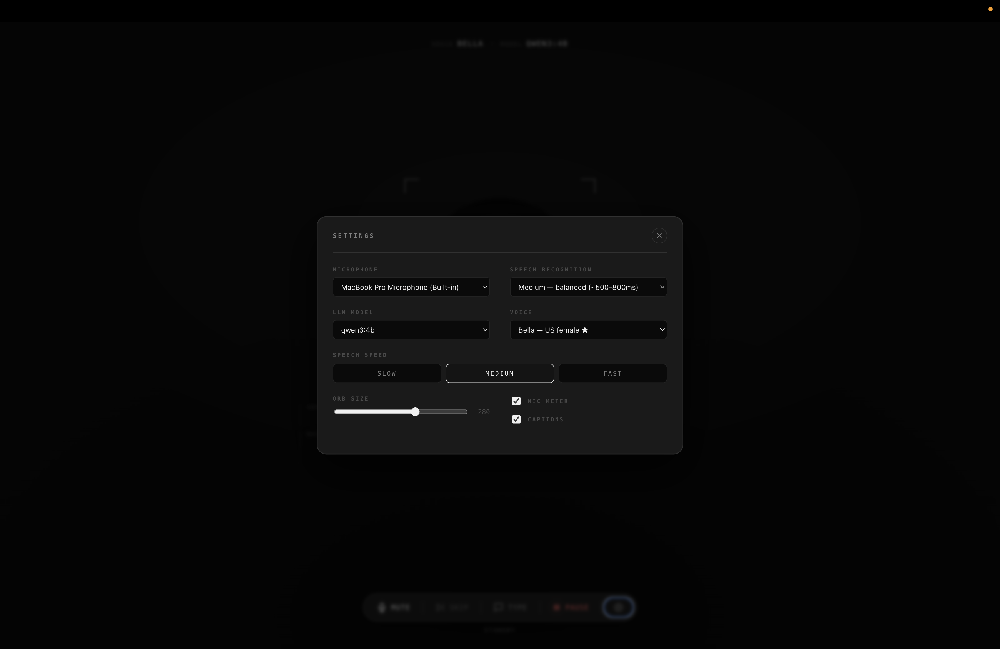

# local-tts

> A fully local voice assistant **and second brain** — speak or type to your LLM, hear it talk back, and have every conversation auto-filed in your Obsidian vault by topic. No cloud. No API keys. No data leaves your machine.


---

<p align="center">
  
  &nbsp;
  
</p>

---

## Why this is different

Most "local AI voice" projects are either a CLI loop with no real UI, a thin wrapper around a cloud STT/TTS API, or require expensive GPU hardware. This project is none of those.

| | local-tts | Typical local voice project |
|---|---|---|
| **UI** | Browser — 3D neural orb, live captions, one-click settings | Terminal / CLI |
| **Cloud dependency** | None — every model runs on-device | STT or TTS calls an API |
| **Hardware** | Apple Silicon, 24 GB+ unified memory (tested: M5 Pro 48 GB) | Often requires NVIDIA GPU |
| **First word latency** | ~2.5 s end-to-end | 3–8 s (round-trip to cloud) |
| **Voice / model switching** | Hot-swap in the UI, no restart | Config file edit + restart |
| **Cross-device** | Phone + tablet over LAN via HTTPS | Localhost only |
| **Echo cancellation** | Browser WebRTC AEC — no headphones needed | PTT key or headphones required |

The pipeline is a streaming cascade: Parakeet transcribes **live as you speak**, Smart-Turn decides when you're actually done, Ollama generates, and CSM-1B synthesizes each sentence as it arrives — so the assistant **starts speaking before the full reply is generated**.

---

## Tech stack

| Layer | Technology |
|---|---|
| **LLM** | [Ollama](https://ollama.ai/) — default NVIDIA **`nemotron-3-nano:4b`** (`think=False`); any local chat model selectable, with **function-calling / tools** |
| **STT** | NVIDIA [Parakeet](https://github.com/senstella/parakeet-mlx) (MLX, **streaming** live captions) — the sole ASR engine |
| **Turn-taking** | [Smart-Turn v3](https://github.com/pipecat-ai/smart-turn) — semantic end-of-turn (ONNX/CPU ~12 ms) over webrtcvad; VAD-only fallback |
| **TTS** | [CSM-1B](https://huggingface.co/mlx-community/csm-1b) (Sesame Conversational Speech Model) via [mlx-audio](https://github.com/Blaizzy/mlx-audio) — Metal, 24 kHz, 2 presets + voice cloning |
| **Server** | [FastAPI](https://fastapi.tiangolo.com/) + WebSocket — streams audio sentence-by-sentence |
| **Frontend** | React + TypeScript + Vite + zustand — three.js neural orb, AudioWorklet capture |
| **Wake-word** | [openWakeWord](https://github.com/dscripka/openWakeWord) (optional, opt-in extra) |
| **Persistence** | Markdown export to [Obsidian](https://obsidian.md/) vault, organized by topic |
| **Web search** | DuckDuckGo HTML (no API key, no signup) — provider interface is swappable |

---

## Quick start

Requires macOS on Apple Silicon, Python 3.10+, and [Ollama](https://ollama.ai/).

```bash
# 1. Start Ollama and pull a chat model
ollama serve &                          # or launch the Ollama desktop app
ollama pull nemotron-3-nano:4b          # default; any chat model works

# 2. Clone & install
git clone git@github.com:MKS-01/local-tts.git
cd local-tts
python3.11 -m venv .venv && source .venv/bin/activate
pip install torch==2.4.0 torchaudio==2.4.0
pip install -e .

# 3. Build the React frontend (one-time; rerun after edits in local_tts/web/frontend/)
cd local_tts/web/frontend && npm install && npm run build && cd ../../..

# 4. Launch
local-tts                               # http://127.0.0.1:8000
```

Speech models download automatically on first run (Parakeet ~2.5 GB, CSM-1B ~6.2 GB, Smart-Turn ~8 MB). No HuggingFace login needed.

---

## Interface

The UI is a single browser page — no Electron, no desktop app. Open `http://127.0.0.1:8000` after launching.

**Header chips** — five clickable chips at the top show the active runtime state: `voice` · `model` · `persona` · `tools` (ON / OFF) · `vault` (ON / OFF). Tap any chip to jump straight into Settings.

**Orb** — a three.js point-cloud that reacts to phase: dim and breathing when idle, bright and active when speaking. Ghost theme: matte white/grey, no colored glow.

**Live captions** — the INPUT label animates to `LISTENING_` (blinking cursor) while waiting and `PROCESSING ···` (dot reveal) while the LLM is thinking. The AI response streams in sentence by sentence. Empty input slot shows a hint matching the current listening mode.

**Dock controls (bottom bar):**

| Button | What it does |
|---|---|
| **Mute** | Toggle mic on/off |
| **Skip** | Interrupt the current AI response immediately |
| **Type** | Slide-up text input — bypasses STT, still gets a voice reply |
| **Pause / Resume** | Freeze everything (mic, playback, timer) — WebSocket stays open |
| **⚙ Settings** | Open the settings panel |

### Settings panel — model, voice, persona, tools

The settings panel lets you change every runtime parameter **without restarting the server**:

- **Microphone** — switch between any input device the browser sees; new device activates instantly.
- **ASR Model** — **Parakeet** (NVIDIA, MLX) streams live captions as you speak — the sole ASR engine. Pick the checkpoint:
  - `parakeet-tdt-0.6b-v2` ★ (English), `-v3` (25 langs), `-1.1b` (most accurate), `-rnnt-0.6b`, `-ctc-0.6b`.
  - The picker disables while the new model loads; re-enables on server confirmation.
- **LLM Model** — switch between any model currently pulled in Ollama (default `nemotron-3-nano:4b`). Change takes effect on the next message.
- **Voice (TTS)** — CSM-1B voices, switchable instantly while idle (presets and clones share one model — no reload):
  - `conversational_a` ★ (female, default), `conversational_b` (male)
  - Plus any **cloned voices** you add under `tts.csm.clones` (shown as `clone:<name>`) — clone any voice from a short reference clip; see `scripts/make_clone_voice.sh`. CSM is **English-best**.
- **Persona** — swap the system prompt at runtime. Ships with `default` (sharp, tech-savvy and easygoing, 3–4 sentences), `concise` (one sentence), `researcher` (answer-first, cites specifics, separates fact from inference), `chef` (veg-leaning Indian home cooking), `professor` (Miss Phd — witty AI/ML lecturer), and a `custom` slot with a textarea you can edit and save.
- **Internet research (Tools)** — master toggle plus per-tool checkboxes. When on, the LLM can call `clock` and `web_search` (DuckDuckGo, no API key) and fold results into its response.
- **Speech Speed** — Slow / Medium / Fast (currently a no-op — CSM-1B has no speed control; the slider is kept for a future engine).
- **Orb size** — 120–380 px slider.
- **Mic meter / Captions** — toggle the 5-bar input meter and live transcript display.

All preferences persist in `localStorage` (key `local-tts.prefs.v9`) and restore on next page load. STT model, voice, and speech-speed prefs round-trip back to the server on reconnect; persona, tools, and listening-mode currently mirror the server's `config.yaml` values on each fresh connection.

---

## Second-brain features

The bundled `config.yaml` ships with **tools and Obsidian export both enabled** so the first run exercises every feature. Disable individually by flipping `tools.enabled` or `obsidian.enabled` to `false`.

### Obsidian vault export

When `obsidian.enabled: true`, every call writes a markdown transcript into your vault, organized by topic. The folder name is chosen by the LLM at session end — so a debugging chat lands in `debug-session/`, a recipe chat lands in `recipe-ideas/`, etc.

```yaml
obsidian:
  enabled: true
  vault_root: ~/Documents/Obsidian/local-tts   # any path, ~ expanded
  topic_model: null                             # null = reuse ollama.model
```

File layout:

```
~/Documents/Obsidian/local-tts/
├── project-planning/
│   └── 2026-05-19--7f3a9e.md
├── recipe-ideas/
│   └── 2026-05-18--12c3aa.md
└── unsorted/                                    # sessions <2 turns or topic call failed
    └── 2026-05-17--9bc40d.md
```

Each file has YAML frontmatter (`session_id`, `started`, `ended`, `duration_sec`, `model`, `voice`, `persona`, `topic`, `turn_count`) followed by the full turn-by-turn transcript — readable in any markdown editor, searchable in Obsidian's graph view.

Crash-recovery JSONL files are kept at `~/.local-tts/sessions/<id>.jsonl` while a session is in progress and deleted once the markdown is committed. The topic-classification LLM call runs in `asyncio.to_thread` as a fire-and-forget task on disconnect, so closing the browser tab doesn't block.

### Internet research (tools)

When the Tools toggle is on, the assistant can call functions and fold their output into the response. Two ship today:

- **`clock`** — local date/time. Tiny, useful for "what time is it?".
- **`web_search`** — DuckDuckGo HTML search. No API key, no signup. The provider is behind a `WebSearchProvider` Protocol so swapping to Tavily / Brave later is one file.

The LLM client does a non-streaming probe for tool_calls (max 3 hops), runs each tool, appends the result as a `tool` role message, then streams the final response. Tool round-trip content stays out of the TTS stream — the user only hears the answer, not the planning chatter.

Ships **on** by default in the bundled `config.yaml`. Per-tool checkboxes in Settings let you disable individual tools without turning the whole feature off; set `tools.enabled: false` in `config.yaml` to disable entirely.

### Persona switching

The system prompt is one of several runtime-swappable presets (`default`, `concise`, `researcher`, `chef`, `professor`, `custom`). The `swap_persona` flow mirrors the `Transcriber.swap_model` pattern — `threading.Lock`, atomic ref swap, in-flight responses finish on the old prompt. Custom prompt edits round-trip from the browser back to the server and persist across reconnects.

---

## Cross-device access (phone / tablet)

Browsers block microphone access on plain HTTP for non-localhost origins. Use `--auto-cert` for HTTPS over LAN:

```bash
local-tts --host 0.0.0.0 --auto-cert
```

The startup banner prints the network URL, SHA-256 cert fingerprint, and a `/cert.pem` download link.

**Trust the cert:**

| Device | Steps |
|---|---|
| **iOS** | Open `/cert.pem` → Settings → General → VPN & Device Management → install → Certificate Trust Settings → toggle on |
| **Android** | Open `/cert.pem` → install as CA certificate (Settings › Security › Install from storage) |
| **macOS** | Download `/cert.pem` → Keychain Access → set to Always Trust |

Cert stored in `~/.local-tts/certs/`, reused across restarts, regenerated if your LAN IP changes.

To use your own cert (e.g. from `mkcert`):

```bash
local-tts --host 0.0.0.0 --cert cert.pem --key key.pem
```

---

## Configuration

Edit `config.yaml` for non-UI knobs:

| Key | What | Default |
|---|---|---|
| `ollama.model` | Any local Ollama chat model | `nemotron-3-nano:4b` |
| `tts.csm.speaker` | CSM-1B voice (`conversational_a`/`_b` or `clone:<name>`) | `conversational_a` |
| `stt.engine` | ASR engine (single value: `parakeet`) | `parakeet` |
| `stt.parakeet.model` | Parakeet checkpoint | `…parakeet-tdt-0.6b-v2` |
| `tts.csm.precision` | Inference precision: `bf16` (clean+fast) / `fp16` / `fp32` (slow) | `bf16` |
| `tts.csm.ref_max_sec` | Voice-prompt cap (s); `null`/`0` = full reference; raise for steadier timbre | `4.0` |
| `turn.enabled` | Smart-Turn v3 end-of-turn (VAD-only fallback if off) | `true` |
| `turn.threshold` | P(turn complete) ≥ this ends the turn | `0.5` |
| `turn.recheck_ms` | How often Smart-Turn re-checks during a pause | `300` |
| `vad.aggressiveness` | WebRTC VAD aggressiveness 0–3 | `2` |
| `vad.silence_end_ms` | Pause before end-of-turn; **lower = snappier** for fast talkers | `480` |
| `vad.min_utterance_ms` | Drop utterances shorter than this (noise blips) | `360` |
| `vad.speaking_cooldown_ms` | Mic stays shut this long after playback (echo guard) | `600` |
| `persona.active` | Active persona name | `default` |
| `persona.personas` | List of `{name, system_prompt}` overrides | (5 seeded) |
| `tools.enabled` | Master switch for function-calling tools | `false` |
| `tools.allowed` | Allowlist of tool names | `[clock, web_search]` |
| `tools.web_search_provider` | Search backend (`duckduckgo` only today) | `duckduckgo` |
| `obsidian.enabled` | Write per-session markdown to the vault | `false` |
| `obsidian.vault_root` | Vault path; `~` is expanded | `~/Documents/Obsidian/local-tts` |
| `obsidian.topic_model` | Override LLM model for topic classification (null = reuse `ollama.model`) | `null` |
| `memory.session_dir` | Crash-recovery JSONL location | `~/.local-tts/sessions` |
| `memory.keep_days` | Rotate JSONLs older than N days | `30` |

> **ASR.** Parakeet (MLX/Metal) streams live captions and finalizes near-instantly. It has no built-in hallucination filtering, so the server drops short filler/backchannel transcripts (`okay`, `mm-hmm`, …) to stop echo/music self-trigger loops. For clean voice input, use headphones or avoid playing other audio through the same speakers.

---

## How it works

```
browser mic → WebSocket (Int16 PCM 16kHz)
  → webrtcvad utterance segmentation
  → Parakeet STT (streaming → live partial captions)
  → phantom/backchannel filter (drop echo/music false triggers)
  → Smart-Turn v3 confirms end-of-turn (else keep listening)
  → Ollama streaming LLM (Nemotron, think=False) ⇄ (tools — when enabled)
  → sentence splitter
  → CSM-1B TTS (per sentence)
  → WebSocket (Float32 PCM 24kHz)
  → browser speaker (gapless AudioBufferSourceNode queue)
  → (on disconnect) topic classifier → Obsidian markdown export
```

The pipeline is **streaming end-to-end**: words appear live while you speak, Smart-Turn avoids cutting you off at mid-thought pauses, and CSM-1B synthesizes each sentence the moment it arrives from Ollama — so playback starts well before the full reply is generated. Tool round-trips do one non-streaming probe (max 3 hops) before the final response streams, so "what time is it?" comes back as natural speech, not a JSON blob.

See [ARCHITECTURE.md](ARCHITECTURE.md) for the system-level view (cascade, threading model, turn lifecycle, extension points) and [CLAUDE.md](CLAUDE.md) for deeper implementation notes on the MLX single-thread executors, interrupt handling, hot-swap locking, Smart-Turn fallback, and the phantom-utterance / speaker-bleed guards.

---

## Changelog

### v0.7.0 — Parakeet-only ASR + anti-feedback tuning + bf16 TTS
- **CSM now runs bf16, not int8 quant (cleaner voice).** Aligned with [MisoTTS](https://github.com/MisoLabsAI/MisoTTS) (same Sesame CSM architecture, which runs bf16 and never quantizes): the int8 group-quantization was garbling/robotizing output (and risked quantizing the Mimi codec). bf16 keeps decode clean and is at least as fast on Apple Silicon (native matmul, no dequant). New `tts.csm.precision` knob (`bf16`/`fp16`/`fp32`). Reference handling matches MisoLab — `tts.csm.ref_max_sec: null` uses the full reference; the cap now trims prompt audio *and* transcript together (a mismatched pair garbled clones).
- **Whisper removed.** Parakeet (MLX, streaming) is now the sole ASR engine; the `faster-whisper` dependency and the dual-engine selector are gone. The `ASREngine` protocol + `Transcriber` facade stay, so a second engine remains a one-file addition. Lighter install, simpler config (`stt.whisper` dropped).
- **Phantom-utterance guard.** Parakeet has no no-speech/log-prob hallucination filtering, so it transcribed TTS bleed, room reverb, and background music into short backchannels that self-triggered a runaway reply loop. The server now drops whole ASR utterances that normalize to pure fillers (`okay`, `mm-hmm`, `uh huh`, `thank you`, …) — ASR text only; typed input and `yes`/`no` are untouched. Reverb cooldown raised to 0.6 s.
- **Latency tuning, now config-driven.** The turn/segmentation timings are exposed in `config.yaml` instead of hardcoded — `vad.silence_end_ms` (end-of-turn pause, default 480 ms, was 750 ms), `turn.recheck_ms` (Smart-Turn re-check cadence, 300 ms), `vad.min_utterance_ms` (360 ms), `vad.speaking_cooldown_ms` (echo guard, 600 ms). Dial `silence_end_ms` down for fast talkers — Smart-Turn backstops false early ends. CSM voice-prompt cap (`tts.csm.ref_max_sec`) defaults to 4 s — raise toward 5 s if the voice sounds garbled/robotic (too-short prompt destabilizes timbre), lower toward 3 s for more realtime headroom. `tts.csm.temperature` default lowered to 0.7 for steadier output.
- **Clone reference transcription** now runs through Parakeet (English-only). Non-English clones must set `ref_text` explicitly in config.

### v0.6.0 — CSM-1B TTS (Sesame, MisoTTS-family)
- **CSM-1B replaces Qwen3-TTS.** [`mlx-community/csm-1b`](https://huggingface.co/mlx-community/csm-1b) (Sesame Conversational Speech Model — the open base the [MisoTTS](https://www.misolabs.ai/) family is built on) via the same `mlx-audio` library (Metal, 24 kHz). More natural, conversational voice quality, with built-in reference-audio voice cloning. SilentCipher watermark on by default (`tts.csm.watermark`).
- **One model, instant voice swaps.** Presets (`conversational_a`/`_b`) and `clone:<name>` voices share a single loaded model — no checkpoint reload between them (Qwen swapped between CustomVoice/Base). Clones reuse the existing `voice/` clips + `scripts/make_clone_voice.sh`.
- **Engine seam kept** for a future MisoTTS-8B MLX port (`cfg.tts.engine`). Legacy `tts.qwen` configs auto-migrate to CSM on load.
- **Tradeoffs:** English-best (the multilingual Qwen speakers are gone); the speed slider and per-clone `instruct` are inert (CSM has no equivalents); multi-turn conversational context is a follow-up (mlx-audio's public `generate()` conditions on one segment). Target hardware: Apple Silicon M-series / 48 GB (M5 Pro).

### v0.5.0 — Open-model voice pipeline (NVIDIA/Qwen, Apple Silicon)
- **Dual ASR engine, switchable at runtime.** **Parakeet** (NVIDIA, via `parakeet-mlx` on Metal) is the default with **live streaming captions**; **Whisper** (faster-whisper, batch) stays as a one-click alternative. Two-level picker in Settings (engine + per-engine model). Measured on M5: Parakeet batch RTF ~0.24 vs Whisper medium ~0.61.
- **Smart-Turn v3 turn detection.** Semantic end-of-turn (pipecat `smart-turn-v3.2`, ONNX/CPU, ~7–12 ms) layered on webrtcvad so mid-thought pauses don't cut you off. Graceful fallback to VAD-only if the model can't load.
- **Nemotron LLM by default.** `nemotron-3-nano:4b` with reasoning disabled (`think=False`) and a streaming `<think>…</think>` stripper so traces are never spoken. Any pulled Ollama model (e.g. `nemotron3:33b`, `qwen3`) stays selectable.
- **Qwen3-TTS replaces Kokoro.** Qwen3-TTS-0.6B via `mlx-audio` (Metal, 24 kHz, 9 preset speakers). Warm RTF ~0.21, streaming first-chunk ~126 ms on M5.
- **Live partial captions** while you speak (Parakeet), plus a "still listening" hint during Smart-Turn pauses.

### v0.4.0 — Second brain
- **Obsidian export.** Every call writes a markdown transcript into your vault, topic-organized via an LLM call at session end. Crash-recovery JSONL files at `~/.local-tts/sessions/`. Enabled in the bundled config.
- **Tools / function-calling.** `clock` and `web_search` (DuckDuckGo, no API key) ship out of the box; provider interface ready for Tavily / Brave swap-ins. Per-tool checkboxes in Settings.
- **Persona switching.** Five seed personas (`default`, `concise`, `researcher`, `chef`, `professor`) plus a `custom` slot with a textarea. Runtime swap mirrors `Transcriber.swap_model` — in-flight responses finish on the old prompt.
- **React + Vite + TypeScript frontend.** Replaces the 1,295-line vanilla-JS bundle. Three.js orb and AudioWorklet stay imperative inside hooks; settings/captions/dock are now components. Five header chips surface every runtime-switchable state at a glance.

### Deferred
- **Wake-word listening.** Backend (`local_tts/wakeword/`, `[wakeword]` extras, server WS handler) is in place but the UI is hidden — openWakeWord's bundled keywords are limited to `alexa` / `hey_jarvis` / `hey_mycroft` and custom keywords need multi-hour training. Coming back with a Picovoice Porcupine backend that supports free-tier-trained custom keywords in ~30 seconds.

### v0.3.0 — Web UI overhaul
- Single Ghost theme (matte white/grey), header simplified to inline meta row, captions reworked as borderless open sections, scanline removed. See [CLAUDE.md](CLAUDE.md) for the full v0.3 design notes.

---

## License

MIT — see [LICENSE](LICENSE).
