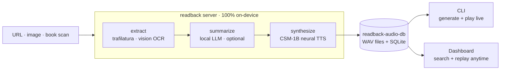

<p align="center">
  
</p>

<p align="center">
  <strong>Paste a URL or snap a book — hear it read aloud by a neural voice, entirely on your Mac.</strong><br>
  No cloud. No API keys. Nothing leaves your machine.
</p>

<p align="center">
  <sub>⚡ A 1,440-word article: summarized in 8.6s, read aloud in 38s — synthesis is ~2× faster than it used to be.</sub>
</p>

<p align="center">
  
  
  
  
</p>

<p align="center">
  <a href="https://mks-01.github.io/readback/">Landing page</a> ·
  <a href="#getting-started">Getting started</a> ·
  <a href="#library-dashboard">Dashboard</a> ·
  <a href="#how-it-works">How it works</a> ·
  <a href="#voices">Voices</a> ·
  <a href="#configuration">Config</a> ·
  <a href="#pi-deployment">Pi deploy</a> ·
  <a href="#design-system">Design system</a>
</p>

<p align="center">
  <br>
  <sub>The terminal client mid-read: seekable player, live word-by-word transcript sync.</sub>
</p>

---

**Your reading list, out loud.** Drop in a link, a photo of a page, or a folder of book scans. readback pulls out the text, optionally has a local LLM boil it down to a spoken briefing, and reads the whole thing to you in a voice you picked — then files it away so you can replay it any time, on any device in the house.

**The model never leaves your Mac.** Summaries are written by an MLX model running in the *same process* as the TTS. That same model does the OCR on your book scans, so there's no second download and no second daemon. No Ollama, no API key, no token bill. Fetching a URL is the only thing here that touches the network; the thinking and the talking are entirely yours.

**And you're not locked to one model.** `Qwen3.5-9B` is just the default. Pull down any MLX chat model you like — something smaller if you want it snappier, something bigger if you want better prose — and it shows up in `/model` with a RAM-fit verdict against your actual memory. Switching takes effect on the very next read: no restart, no config edit.

```bash
huggingface-cli download mlx-community/gemma-2-27b-it-4bit   # then pick it in /model
```

The one catch: because the summary model *is* the OCR model, picking a text-only one turns off image and book-scan reads. URLs keep working.

---

## Getting started

> **Requires macOS on Apple Silicon (M1–M5).** Everything runs on MLX/Metal, so speed scales with GPU cores and unified memory. All timings below are from an M5 Pro / 48 GB.

```bash
git clone https://github.com/MKS-01/readback.git && cd readback
bash scripts/setup.sh     # idempotent — safe to re-run
readback-cli              # from anywhere; auto-starts the server
```

Paste a URL → audio plays in your shell.

- **`setup.sh` does everything** — checks platform, creates `.venv`, installs readback + CLI + dashboard, optionally pre-downloads the models.
- **Needs [Bun](https://bun.sh/)** — the script tells you if it's missing.
- **First read downloads ~11.5 GB** — CSM-1B weights (~6 GB) + the LLM (~5.5 GB) into the HuggingFace cache, then warms the MLX graph. Slow once, fast after.

Full setup, flags, and troubleshooting: [`docs/SETUP.md`](docs/SETUP.md).

<details>
<summary><strong>Prefer to set it up by hand?</strong></summary>

```bash
# 1. Install the server
git clone https://github.com/MKS-01/readback.git && cd readback
python3.12 -m venv .venv && source .venv/bin/activate
pip install -e .                        # csm-mlx + mlx-lm are git/PyPI deps, pulled automatically

# 2. Build + install the terminal client → ~/.local/bin/readback-cli
cd src/cli && ./install.sh && cd ..

# 3. Read something
readback-cli                            # from anywhere; auto-starts the server
```
</details>

### The terminal client

<p align="center">
  
</p>

Auto-starts the server, kills it on exit. A full player, in your shell:

- **Keys** — `space` pause · `←/→` seek ±5 s · `t` toggle transcript · `+/-` playback speed · `q` quit
- **Commands** — `/voice` · `/model` (LLM for summary *and* OCR, with a RAM-fit check) · `/mode` · `/speed` · `/lib` (browse, `space` previews inline, `enter` opens the player) · `/help`
- **Reads anything** — a URL, an image path, a folder or glob of book scans
- macOS only (`afplay` playback) — internals: [`src/cli/README.md`](src/cli/README.md)

---

## Library dashboard

Every read is saved to a local SQLite library. The dashboard **replays any past read** — no LLM, no GPU, just the saved audio.

<p align="center">
  <br>
  <sub>Search, sort, and replay past reads — no GPU involved.</sub>
</p>

- **Search** title / summary / URL · **sort** newest↔oldest · **paginate** 20 at a time
- **Full player** per card — click-to-seek, ±5 s skip, `space` + `←/→` keyboard parity with the CLI
- **Synced transcript** — word-by-word highlight in blue, same as the CLI
- **Delete** removes the DB row *and* its WAV
- **Vue 3 SPA, pure REST** — built `dist/` is served at `/` by the same `readback` process; `bun run dev` runs Vite on `:5173`. Details: [`src/dashboard/README.md`](src/dashboard/README.md)

Because it never needs the GPU, the dashboard can live somewhere else entirely — see [Pi deployment](#pi-deployment).

---

## How it works



1. **Extract** — `trafilatura` pulls article text (browser-UA fallback for 403s). Images/book scans → mlx-vlm OCR on the same model that writes the summary. Folders/globs → OCR'd in filename order, stitched into one document.
2. **Summarize** *(optional)* — mlx-lm rewrites it as a spoken explanation. Full mode skips this entirely. Long scans **map-reduce** instead of truncating.
3. **Synthesize** — sentence-aware chunks → CSM-1B → silence-trimmed → fade-out → joined with pauses taken from the text itself (a paragraph break gets a full breath, a mid-paragraph join carries straight on). Chunks ride the GPU in **batches of 8**.
4. **Serve** — WAV over HTTP; progress streams live over the WebSocket.

- **Source-aware tone** — a URL reads as a livelier article explainer; a book scan reads calmer, opening by naming the chapter. Automatic, nothing to set.
- **Re-reads are instant** — cache hit on URL + mode + voice + model + pipeline version skips the whole pipeline.

Full system view: [`docs/ARCHITECTURE.md`](docs/ARCHITECTURE.md).

### Fast *and* faithful

Synthesis used to be 77% of a read's wall time. CSM emits one frame per 80 ms of audio, each frame 1 backbone step + 31 **sequential** decoder steps — ~400 tiny matmuls per second of audio. That's launch-latency bound, not compute bound, so the GPU sat idle between kernels. Running 8 chunks through **one shared frame loop** does 8× the work in 1.64× the time:

| batch | ms/frame | audio produced per wall-second |
|---|---|---|
| 1 | 51.6 | 1.55 s |
| 4 | 82.1 | 3.90 s |
| **8** | 84.8 | **7.55 s** |

- **A 1,440-word article reads in 38 s end to end** — 0.7 s fetch · 8.6 s summarize · 29 s to synthesize 90 seconds of speech.
- **Nothing was paid for in quality.** Batching left-pads prompts, and those pads were silently diluting attention — top-1 confidence collapsed 0.193 → 0.049, heard as a soft, muffled voice. Masking them out restores the unpadded distribution to within bf16 noise.
- **Expression survives batching** — each chunk carries its own delivery temperature, nudged from its punctuation, instead of flattening across the batch.

**The summary step, day 0 → today: ~76 s → ~4 s.**

---

## Tech stack

Extraction, summary, and TTS all run in one process on MLX/Metal — there is no daemon anywhere in this list.

| Layer | Technology |
|---|---|
| **Extraction** | [trafilatura](https://trafilatura.readthedocs.io/) — URL → clean text (+ browser-UA fallback); [mlx-vlm](https://github.com/Blaizzy/mlx-vlm) OCR for images / book scans, running the summary model |
| **Summary (optional)** | [mlx-lm](https://github.com/ml-explore/mlx-lm) — default `Qwen3.5-9B-4bit`; any downloaded MLX chat model works |
| **TTS** | [CSM-1B](https://huggingface.co/senstella/csm-1b-mlx) (Sesame) via [csm-mlx](https://github.com/senstella/csm-mlx) — 24 kHz, bf16 |
| **Voices** | 2 built-in reading voices + **clone any voice from a short clip** + optional **LoRA fine-tuning** |
| **Server** | [FastAPI](https://fastapi.tiangolo.com/) + WebSocket — streams progress, serves the WAV, REST library |
| **CLI client** | Bun + TypeScript + [Ink](https://github.com/vadimdemedes/ink) — terminal UI, `afplay` playback |
| **Dashboard** | [Vue 3](https://vuejs.org/) + [Vite](https://vite.dev/) + TS — replay past reads (search/sort/player); stdlib SQLite library |

---

## Voices

CSM conditions on a short reference clip — the clip's timbre and accent are what you hear.

- **Built-in** — `conversational_a` (female ★) / `conversational_b` (male)
- **Clone** — a 5–8 s mono clip + its exact transcript in `config.yaml`:

  ```yaml
  tts:
    csm:
      speaker: "codeword"
      temperature: 0.7          # delivery: lower = composed, higher = livelier
      voices:
        - name: "codeword"
          label: "Codeword ★"
          wav: "src/voice/voice_codeword.wav"
          speaker: 0
          ref_text: "Exact transcript of the clip."   # MUST match the audio
  ```

- **LoRA fine-tune** — higher fidelity with more audio: [`src/finetune/README.md`](src/finetune/README.md)

---

## Configuration

Edit `config.yaml` (or pass `--config path`). The defaults work out of the box.

| Key | What | Default |
|---|---|---|
| `llm.model` | MLX model for Summary mode **and** image / book-scan OCR (HuggingFace ID). Must be a vision model for image reads | `mlx-community/Qwen3.5-9B-4bit` |
| `tts.csm.speaker` | Active voice (`conversational_a`/`_b` or a clone `name`) | `codeword` |
| `tts.csm.precision` | `bf16` (clean+fast) / `fp16` / `fp32` (slowest, cleanest) | `bf16` |
| `tts.csm.temperature` | Delivery: lower = composed, higher = livelier | `0.7` |
| `tts.csm.top_k` | Sampler top-k, works alongside `temperature` | `50` |
| `tts.csm.voices` | Clone voices (`name`, `label`, `wav`, `ref_text`, `speaker`) | sample `codeword` |
| `tts.csm.ref_max_sec` | Trims the reference clip **and** its transcript together (a mismatched pair garbles the voice). `null` = full clip | `null` |
| `tts.csm.lora_path` | LoRA adapter dir from a `csm-mlx finetune` run | `null` |
| `tts.csm.max_audio_length_ms` | Per-chunk generation cap — a runaway-generation safety bound. ⚠ Set it too low and ordinary chunks get clipped mid-sentence | `30000` |
| `tts.csm.batch_size` | Chunks per CSM frame loop — the main speed knob. `1` restores the sequential path | `8` |
| `reader.default_mode` | `full` (verbatim) or `summary` (LLM) | `full` |
| `reader.output_dir` | Where generated WAVs are written/served | `../readback-audio-db/audio` |
| `reader.gap_sec` | Base pause between chunks — scaled per join (2× at a paragraph break, 0.6× mid-paragraph) | `0.18` |
| `reader.summary_max_chars` | Per-pass chunk size for Summary mode — longer inputs are map-reduced, not truncated | `60000` |
| `reader.library_db` | SQLite library of past reads (powers the dashboard) | `../readback-audio-db/library.db` |

- Audio + library DB live in a **`readback-audio-db/`** folder beside the repo. Point `output_dir` / `library_db` anywhere (absolute or `~` both work).
- **Flags** — `readback --model <name>`, `--host`, `--port`, `--config`. Use `--host 0.0.0.0` for LAN access.

---

## Pi deployment

Generation stays on the Mac (CSM-1B + MLX need Apple Silicon). A Raspberry Pi runs the lightweight read-only server — library REST, Vue dashboard, audio serving — so your reads are reachable from **any browser on the network**. It runs under [PiZoW](https://github.com/MKS-01/pizow) (PM2, survives reboots, ~68 MB — Readback itself sits at ~6 MB).

```bash
# one-time setup
cp .env.example .env             # fill in PI_USER, PI_HOST, PI_PATH
bash scripts/deploy-pi.sh        # build dashboard → rsync → venv + pip → PM2
ssh PI_USER@PI_HOST "pm2 startup && pm2 save"   # survive reboots

# after each new read on Mac
bash scripts/sync-pi.sh          # incremental — only new WAVs since last sync
bash scripts/sync-pi.sh --full   # or full sync (cleans orphans on Pi)
```

Dashboard is live at `http://<PI_HOST>:8090`.

---

## Design system

The Ghost palette, type scale, and every UI component — live specimens you can browse locally.

- **7 type rungs** · **9 components** (Badge, Button, PromptLine, SearchInput, SeekBar, WaveformPlayer, ReadCard, Wordmark, SectionHeader) · **3 UI kits** (Terminal, Dashboard, Landing) — all interactive
- **Canonical tokens** live in `src/design-system/tokens/` — the dashboard `@import`s them, the landing page inlines the same values, the CLI mirrors the palette in `src/cli/src/theme.ts`

```bash
cd src/design-system && python3 -m http.server 8111
# open http://localhost:8111
```

---

## License

MIT — see [LICENSE](LICENSE).

<p align="center">
  <sub>Built agent-first with <a href="https://claude.ai/code">Claude Code</a></sub>
</p>
