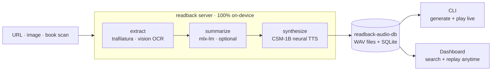

  

# Building readback, agent-first

> _How a real-time voice assistant became an offline article reader — built
> almost entirely through Claude Code. The pivots, the decisions, and the
> things that broke along the way._

I wanted to see how far you could take an agentic workflow on a real project —
not a toy, but something I'd actually use every day. readback is the result:
a fully on-device article reader that went through two major pivots, a complete
engine swap, and dozens of features, with the agent driving nearly every commit.
The takeaway? Agent-first isn't autopilot — it's a force multiplier that still
needs a human steering hard at the forks.

---

## 1. The arc — what readback became

readback didn't start as an article reader. It started as a **real-time local
voice assistant** called `local-tts` and pivoted twice before landing on what
it is now:

The shape that matters: **generation** (extract → LLM → TTS) is the heavy,
occasional half that wants the Mac's GPU; **replay** is light and model-free.
One URL in, audio out, two clients reading from the same on-device store.
Re-reads hit a cache and skip the pipeline entirely.

   
  The library dashboard — search, sort, and replay any past read with a seekable player and word-synced transcript.

### Timeline

- **Initial commit** — *"Sesame-like local voice conversation CLI"*: a real-time
  speech-to-speech loop. The idea that started it all.
- **Early web era (v0.2–v0.4)** — Kokoro TTS, Whisper STT, a push-to-talk web UI,
  the Ghost theme, HTTPS, mobile audio fixes, then second-brain features (tools,
  Obsidian export, personas) + a React frontend. Feature creep at its finest.
- **v0.5.0** — full open-model voice pipeline: dual ASR + Smart-Turn + webrtcvad +
  Nemotron + Qwen3-TTS, speaker-bleed mic gate, voice cloning. The most complex
  the project ever got — and the moment it became clear the complexity wasn't
  earning its keep.
- **The pivot → v0.8.0** — ripped out the entire live cascade (STT, VAD,
  Smart-Turn, mic, echo gate, wake-word, personas, tools, Obsidian), moved to
  **CSM-1B** via `csm-mlx`, and renamed `local-tts` → `readback`. The product
  became: *URL → article → audio, offline*. Deleting was the feature.
- **v1.0.0** — the **terminal CLI** (Bun + Ink) as a pure `/ws` client.
- **v1.1.0** — CLI `/model` switch with RAM-fit verdicts.
- **v2.0.0** — **CLI-only pivot**: web frontend removed, package restructured to
  `src/` layout. The lesson: don't keep a UI you don't use.
- **v3.0.0** — **library dashboard + persistence**: every read saved to SQLite,
  a Vue 3 replay UI. The web came *back* — but as a separate, model-free replay
  client, not the thing that was deleted.
- **v3.1.0** — **UI/UX polish**: animations (guided by the `emil-design-eng`
  skill), redesigned landing page, rounded corners. Presentational only.
- **v3.2.0** — **Pi deployment**: `deploy-pi.sh` + `sync-pi.sh`, PM2-managed
  read-only server on a home Pi via PiZoW, mobile-responsive dashboard.
- **v4.0.0** — **full MLX LLM stack**: Ollama removed entirely. Summary LLM and
  vision OCR now run in-process via `mlx-lm` + `mlx-vlm`, unifying with CSM-1B
  under one framework. Zero external daemons. +25–30% generation speed.
- **v4.1.0** — **audio quality + performance**: read cache (skip the pipeline on
  re-reads), degenerate-chunk guard, crossfade joins, synthesis speed tuning
  (bf16 default, larger chunks, sampler caching), CLI generation timer, venv
  auto-detect.

The two pivots tell the real story. Killing the real-time assistant deleted an
entire class of problems — audio underrun, echo cancellation, wake-word false
positives — and let voice quality win over latency. Removing then reintroducing
the web UI proved that subtraction sharpens the product: the dashboard came back
*better* because it only had to do one thing (replay), not everything.

---

## 2. Building agent-first — the workflow

Most of readback was built by an agent driving a repeatable loop, not ad-hoc
prompting. The conventions live in the repo as skills and memory.

The agent's biggest value was in the boring parts — wiring plumbing, syncing
docs across six surfaces, writing the migration path for a config rename. Where
I had to steer hardest: any decision with taste involved (what to cut, how the
UI should feel, whether to swap engines or tune the one we had).

### The core loop (per feature)

1. **Research first** — read the closest existing analogue end-to-end before
   proposing anything. The dashboard's REST was modeled on the existing
   `/api/*` + `_run_read_job` patterns, not invented from scratch.
2. **Plan entry** — a dated, status-tracked plan (`proposed → in progress →
   done`) written before code, newest on top. See [PLAN.md](PLAN.md).
3. **Approval gate** — genuine forks (framework, delete-vs-read-only, DB
   location, cache key design) go through explicit approval. Decisions the
   agent shouldn't guess.
4. **Phased implementation** — backend → client → verify. One phase fully done
   before the next.
5. **Draft PR as tracker** — opened on the first commit, checkboxes ticked as
   work lands, marked ready only after the test plan passes.
6. **Doc-sync** — a final pass mapping the diff to every doc surface. The
   `doc-sync` skill automates the mapping; the agent runs it, I review.

### The supporting cast

- **Skills** (`.claude/skills/`): `csm-voice` (clone/tune/LoRA), `doc-sync`,
  `drive-cli` (smoke-test via tmux), `landing-page`, `upgrade-deps`, plus
  workflow skills for planning, PRs, and code review.
- **Memory** — persistent preferences that shaped every session: "keep plans
  simple, config-first", "run doc-sync after changes", "single tracker = README
  Roadmap", "stay on CSM-1B", "no Kokoro / Qwen-TTS again". The agent carried
  these forward instead of re-litigating them each time.
- **`CLAUDE.md`** as the agent's ground truth: terse, gotcha-dense, exact file
  paths and knob names, ⚠ markers on traps. This file is the single most
  important piece of the agentic setup — without it, every session starts cold.

The skills/memory system genuinely changed the agent's behavior across sessions.
Without the "stay on CSM-1B" memory, I'd have had to re-argue against engine
swaps every time quality came up. Without the doc-sync skill, docs would have
drifted within a week. The compound effect is what matters — each convention
is small, but together they give the agent a consistent personality.

---

## 3. Technical decisions (and why)

### CSM-1B over everything else

Chose Sesame's CSM-1B (via `csm-mlx`, MLX/Metal, 24 kHz) and committed to it.
A researched engine-swap was explicitly rejected — the bet was to tune CSM
(temperature, reference prompts, silence post-processing, eventually LoRA)
rather than chase a shinier model. This paid off: every version since v0.8.0
improved quality without changing the engine, and the debugging surface stayed
small.

### Everything in-process on MLX

As of v4.0.0, the entire inference stack — summary LLM (`mlx-lm`), vision OCR
(`mlx-vlm`), and TTS (`csm-mlx`) — runs in a single Python process on Metal.
No Ollama, no daemon management, no network calls. This was a deliberate move
from the Ollama-based v3.x stack: fewer moving parts, +25–30% generation speed,
and one less thing to install.

### Batch, not streaming

Synthesis is offline, so the whole piece is rendered up front. That deletes
audio-underrun and echo entirely and lets voice quality win over latency — the
opposite trade-off from the real-time origin.

### `_tidy_silence` — the biggest quality lever

CSM conditioned on the casual Sesame prompt emits long mid-utterance pauses.
`_tidy_silence` trims leading/trailing silence and caps internal pauses to
~300 ms. Model-agnostic post-processing, and the single biggest
perceived-quality improvement. Paired with `_fade_out_tail` (100 ms crossfade
at chunk joins) and `_peak_normalize` (levels every voice to consistent
loudness), these three pure-numpy functions are what make CSM sound polished.

### Generate-once / replay-many

The heavy half (LLM summary + neural TTS) is on-demand CLI work on the Mac's
GPU; replay is a separate, model-free dashboard path that only serves a
finished WAV. This split is why the web UI could come back without violating
the "lean backend" principle, and why a $35 Pi can serve the entire library.

### SQLite via stdlib

The library is `sqlite3`, zero new deps, near-zero RAM. Connections opened per
call, safe across asyncio's threadpool. The same DB serves the dashboard, the
read cache (composite index lookup), and the Pi deployment. No ORM, no
migration framework — just `ALTER TABLE ADD COLUMN` with a try/except.

---

## 4. Lessons & gotchas

The agent got things wrong. Here's the honest list.

- **Vue ate the spaces.** The synced transcript rendered words glued together —
  Vue's template compiler condenses whitespace-only text nodes, so every
  inter-word ` ` rendered empty. Fix: two segments + a dynamic
  joiner space. Caught via headless-Chrome CDP verification, not eyeballing.
- **The invisible filename space.** macOS screenshots use a narrow no-break
  space (U+202F) before "PM". A literal-typed path silently failed to match —
  only a glob found the file. Real time lost to this one.
- **uvicorn won't let go.** Graceful shutdown hangs on an open WebSocket. The
  old SIGTERM-then-busy-wait was self-defeating — Bun's synchronous
  `sleepSync` blocked the event loop it needed to reap the child. SIGKILL
  outright was the right answer for an ephemeral, stateless server.
- **Pause = kill + restart.** `afplay` SIGSTOP/SIGCONT caused CoreAudio buffer
  bleed (~0.5 s of repeated audio on resume). Now pause kills afplay and
  resume restarts from the elapsed position via WAV-slice. The ~50 ms gap is
  intentional.
- **Ink drops ANSI across line breaks.** `wrap="wrap"` loses color state when
  a style boundary crosses a wrap, so the CLI transcript wraps text by hand.
- **Migration ordering matters.** `ALTER TABLE ADD COLUMN` must run before any
  `CREATE INDEX` that references the new column — on an existing DB the table
  already exists, so `CREATE TABLE IF NOT EXISTS` is a no-op and the column
  isn't there yet.
- **Qwen3's untagged thinking.** `enable_thinking=False` on the chat template
  is the only reliable fix — the model emits a plain-text "Thinking Process:"
  preamble with no `<think>` tags, so the stripper can't catch it. Without this,
  a 215-word article took ~76 s instead of ~4 s.

### What I'd tell someone starting an agent-first build

Write your `CLAUDE.md` on day one — not after the project is complex, but
while it's simple enough to describe cleanly. That file is the agent's working
memory, and the quality of every session scales directly with how honest and
precise it is. Encode your preferences as memory, your procedures as skills,
and your decisions in a plan log. Then steer at the forks and let the agent
handle the plumbing.

---

## Stack snapshot (v4.1.0)

| Layer | Tech |
|---|---|
| Extraction | trafilatura (+ browser-UA fallback); mlx-vlm vision OCR for images/books |
| Summary LLM | mlx-lm — in-process on Metal (`Qwen3.5-9B-4bit` default; any MLX chat model) |
| TTS | CSM-1B via `csm-mlx` — in-process, Metal, 24 kHz, bf16 |
| Server | FastAPI + WebSocket + REST library + read cache |
| CLI | Bun + TypeScript + Ink, `afplay` |
| Dashboard | Vue 3 + Vite + TS, stdlib SQLite |
| Pi | PM2 via PiZoW — read-only server, no GPU needed |
| Built with | Claude Code (agent-first) |

---

_See [PLAN.md](PLAN.md) for the dated decision log, [ARCHITECTURE.md](ARCHITECTURE.md)
for the system view, and the root [README](../README.md) to run it._
