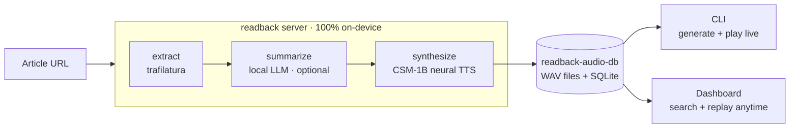

  

# Building readback, agent-first

> _A devlog: how readback was built almost entirely through an agentic workflow
> (Claude Code) — the loop, the pivots, the decisions, and the things that broke._
>
> **TODO (your voice):** open with a 2–3 sentence hook. Why write this up? What's
> the one thing you want a reader to take away about building software this way?

This is a **scaffold** — headings, media, and factual bullets pulled straight
from the repo and its history. Fill the prose under each `✍️` prompt in your own
voice; delete the prompts as you go.

---

## 1. The arc — what readback became

readback didn't start as an article reader. It started as a **real-time local
voice assistant** and pivoted twice into what it is now — a high-level wireframe
of the concept it landed on:

The shape that matters: **generation** (extract → LLM → TTS) is the heavy,
occasional half that wants the Mac's GPU; **replay** is light and model-free. One
URL in, audio out, two clients reading from the same on-device store.

   
  The shipped replay surface. The original hand-drawn brief that kicked this off lives in <a href="PLAN.md">PLAN.md</a>.

> ✍️ **Write the narrative of the arc here.** The bullets below are the facts —
> turn them into the story of how the idea kept sharpening.

**Timeline (from git history + version notes):**

- **Initial commit** — *"Sesame-like local voice conversation CLI"*: a real-time
  speech-to-speech loop (the college-era STT→TTS itch, leveled up).
- **Early web era (v0.2–v0.4)** — Kokoro TTS swap, Whisper STT, a push-to-talk
  **web UI**, the **Ghost theme**, HTTPS cross-device, mobile audio fixes, then
  *second-brain* features (tools, Obsidian export, personas) + a React frontend.
- **v0.5.0** — full open-model voice pipeline: dual ASR + **Smart-Turn** +
  webrtcvad + Nemotron + **Qwen3-TTS**, speaker-bleed mic gate, voice cloning.
- **The pivot → v0.8.0** — *"reactor: reader app"*: ripped out the entire live
  cascade (STT/VAD/Smart-Turn/mic/echo-gate/wake-word/personas/tools/Obsidian),
  moved to **CSM-1B** via `csm-mlx`, and **renamed `local-tts` → `readback`**.
  The product became: *URL → article → audio, offline*.
- **v1.0.0** — the **terminal CLI** (Bun + Ink) as a pure `/ws` client.
- **v1.1.0** — CLI `/model` switch with RAM-fit verdicts.
- **v2.0.0** — **CLI-only pivot**: web frontend removed, package restructured to
  the `src/` layout, TLS/`cryptography` dropped.
- **v2.1.0** — the **library dashboard** (this milestone): persist every read to
  SQLite + a Vue 3 replay UI. The web UI came *back* — but as a separate,
  model-free replay client, not the thing that was removed.
- **By the numbers:** ~81 commits; tags `v1.0.0`, `v1.1.0`, `v2.0.0`.

> ✍️ **The two pivots are the heart of the story.** Why kill the real-time
> assistant? Why later remove the very web UI you'd built, then reintroduce one?
> What did each subtraction buy you?

---

## 2. Building agent-first — the workflow

Most of readback was built by an agent driving a **repeatable loop**, not ad-hoc
prompting. The conventions live in the repo as **skills** and **memory**.

> ✍️ **Describe what it felt like to build this way.** Where did the agent save
> you the most time? Where did you have to steer hard?

**The core loop (per feature):**

1. **Research first** — the agent reads the closest existing analogue end-to-end
   before proposing anything (e.g. model the dashboard's REST + persistence on the
   existing `/api/*` + `_run_read_job` patterns).
2. **`plan.md` entry** — a dated, status-tracked plan (`proposed → in progress →
   done`) written *before* code, newest on top. See [PLAN.md](PLAN.md).
3. **Approval gate** — `AskUserQuestion` for the genuine forks (framework,
   delete-vs-read-only, DB location) — decisions the agent shouldn't guess.
4. **Phased implementation** — backend → client → verify, one phase fully done
   before the next.
5. **Draft PR as tracker** — opened on the first commit, phase checkboxes ticked
   as work lands, marked ready only after the test plan passes.
6. **Doc-sync** — a final pass mapping the diff to every doc surface (CLAUDE.md,
   README, ARCHITECTURE, this file).

**The supporting cast:**

- **Skills** (`.claude/skills/`): project-level `csm-voice` (clone/tune/LoRA) and
  `doc-sync`; plus workflow skills for `plan`, `pr`, and code review.
- **Memory** (persistent prefs that shaped every session): "keep plans simple,
  config-first", "run doc-sync after changes", "single tracker = README Roadmap",
  "stay on CSM-1B", "no Kokoro / Qwen-TTS again". The agent carried these forward
  instead of re-litigating them.
- **`CLAUDE.md`** as the agent's source of truth: terse, gotcha-dense, exact
  file paths and knob names, with ⚠ markers on traps.

> ✍️ **Your honest take on the skills/memory system.** Did encoding your
> preferences as memory actually change the agent's behavior session to session?

---

## 3. Technical decisions (and why)

> ✍️ **Pick the 3–4 decisions you're proudest of** and expand them. Bullets are
> the raw material.

- **CSM-1B over everything else** — chose Sesame's CSM-1B (via `csm-mlx`, MLX/Metal,
  24 kHz) and committed to it: a researched engine-swap was *rejected*; the bet was
  to tune/LoRA CSM to match official quality rather than chase a new model.
- **Batch, not streaming** — synthesis is offline, so the whole piece is rendered
  up front. That deletes audio-underrun and echo entirely and lets *voice quality
  win over latency* — the opposite trade-off from the real-time origin.
- **MLX single-thread rule** — MLX binds its GPU stream to the first thread that
  touches it, so the engine owns a 1-worker executor; all model work runs there and
  read jobs serialize naturally.
- **`_tidy_silence`** — the post-processing that removes CSM's halting feel (trims
  lead/trail silence, caps internal pauses to ~300 ms). Model-agnostic, and the
  single biggest perceived-quality lever.
- **SQLite via stdlib** — the dashboard's library is `sqlite3`, zero new deps,
  near-zero RAM — deliberately Pi-friendly.
- **Generate-once / replay-many split** — the heavy half (LLM summary + neural TTS)
  is on-demand CLI work on the Mac's GPU; replay is a separate, **model-free**
  dashboard path that only serves a finished WAV. This is *why* the web UI could
  come back without violating the "lean backend" principle.
- **`afplay` + RIFF-slice seek** — afplay has no transport, so the CLI seeks by
  slicing the WAV's PCM at a byte offset and relaunching. Pause = SIGSTOP/SIGCONT.

> ✍️ **The CSM commitment is a story in itself** (see the [tuning
> plan](PLAN.md)). Why hold the line on one model instead of swapping?

---

## 4. Lessons & gotchas — what broke, and the fix

The agent got things wrong and self-corrected. The honest bits.

> ✍️ **This is the most relatable section — lean in.** Which bug was the most
> "of course"? Where did agentic verification actually catch something?

- **Vue ate the spaces.** The synced transcript rendered words *glued together*
  and overflowing the card — Vue's template compiler **condenses whitespace-only
  text nodes**, so every inter-word ` ` rendered empty. Fix: two
  segments (blue spoken / dim rest) + a *dynamic* joiner space + `overflow-wrap`.
  Caught and confirmed via **headless-Chrome over CDP** (`scrollWidth ==
  clientWidth`) — agentic verification, not eyeballing.
- **The invisible filename space.** A macOS screenshot's name uses a **narrow
  no-break space (U+202F)** before "PM", so a literal-typed path silently failed
  to match — only a glob found the file. (Real time lost to this one.)
- **uvicorn won't let go.** Graceful shutdown hangs on an open WebSocket, so the
  CLI SIGTERMs the spawned server then **SIGKILLs after 1.5 s**.
- **SIGSTOP before SIGTERM.** A paused (`SIGSTOP`-ed) `afplay` can't handle
  SIGTERM — always SIGCONT first.
- **Ink drops ANSI across line breaks.** `wrap="wrap"` loses color state when a
  style boundary crosses a wrap, so the CLI transcript wraps text *by hand*.
- **"Looks like a bug, isn't":** first synth is slow (one-time graph warm-up + 6 GB
  download); `speed` is inert (CSM has no speed knob); clones garble on a bad
  `ref_text` or too-short low-temp reference; `<think>` leaks only on qwen3.

> ✍️ **Close it out.** What would you tell someone starting an agent-first build
> tomorrow? One paragraph.

---

## Stack snapshot

| Layer | Tech |
|---|---|
| Extraction | trafilatura (+ browser-UA fallback) |
| Summary LLM | Ollama (`gemma4:26b` default; any chat model) |
| TTS | CSM-1B via `csm-mlx` — MLX/Metal, 24 kHz, fp32 |
| Server | FastAPI + WebSocket + REST library |
| CLI | Bun + TypeScript + Ink, `afplay` |
| Dashboard | Vue 3 + Vite + TS, stdlib SQLite |
| Built with | Claude Code (agent-first) |

---

_See [PLAN.md](PLAN.md) for the dated decision log, [ARCHITECTURE.md](ARCHITECTURE.md)
for the system view, and the root [README](../README.md) to run it._
