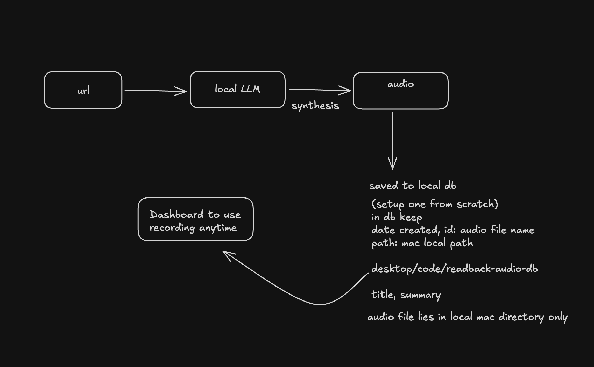

# Plans

Planning history for readback — newest entry on top, older entries kept below for
tracking. Each entry carries a date and a status (`proposed` / `in progress` /
`done` / `superseded`).

---

## 2026-06-14 — Landing page layout rework (de-box + catchier hero)

**Status: done** — branch `feat/animations`. The page read as a rigid stack
of bordered rectangles; rework it to structure with whitespace + typography +
a couple of intentional surfaces (per `emil-design-eng`: "beauty is leverage",
reduce noise, cohesion). User-approved direction: bold rework.

### Design

1. **De-box.** Drop most `1px` borders. Sections separate with air + a single
   **hairline rule under each `##` header**, not a full box. Keep only two framed
   surfaces — the **screenshot viewer** (`.demo-frame`) and the **`--features`
   terminal** (`.feat-term`) — since those genuinely are screens/terminals.
2. **Sample player** — borderless; the waveform floats on the page (play button
   keeps its accent outline since it's a control).
3. **Step rail → underline tabs.** `.demo-steps`/`.demo-step` lose the boxed
   panel; active step = accent text + accent underline on a shared baseline rule.
   The rAF progress bar (`#demo-progress`) stays (timing), JS untouched.
4. **Hero.** Kicker above the wordmark: `// a weekend project · built with Claude
   Code` (Martian Mono). Tagline → **"Your reading list, read to you."** (USP +
   the name: readback = read back to you); pitch → "A natural neural voice reads
   whole articles aloud — right in your terminal, entirely on-device. Nothing
   leaves your Mac." Copy mined from docs/JOURNEY.md, not generic.
5. **Rhythm.** More vertical air; bigger `##` headers; hero stays centered, content
   sections left-aligned (incl. the Dive-in CTA) for variety vs the all-centered
   monotone.
6. **Animation** — keep everything (ease-out curves, stagger, stepper progress,
   reduced-motion); just re-apply to the new structure.
7. **Softer corners + no `##`.** Sharp box corners read harsh, and the `##`
   header prefix looked like broken markdown to non-tech viewers. Added
   `--radius: 8px` on buttons/frames/panels (rounded-square sample play button,
   4px on inline code), and dropped the `##` spans from all `h2`s (the hairline
   rule already separates them). The **dashboard** got the same `--radius: 8px`
   for cohesion — search box, sort toggle, the cards panel (+ `overflow:hidden`),
   play + skip buttons, load-more.

### Files

- `src/landing-page/index.html` — hero kicker + new copy; step-rail markup stays.
- `src/landing-page/style.css` — de-box, hairline headers, underline tabs,
  left-align, hero kicker, spacing.

### Out of scope

- Section content/order changes beyond the hero copy (order stays hook-first).
- New media; dashboard; the repo docs.

### Verification

1. Headless screenshot: few/no full-box borders; hairline under each header;
   underline tabs; borderless player; kicker + new tagline render.
2. CDP: stepper progress still fills; `:focus-visible` rings intact;
   reduced-motion keeps opacity, drops movement.
3. Mobile width renders without overflow.

---

## 2026-06-14 — Emil re-review fixes + landing-page design pass + content trim

**Status: done** — branch `feat/animations`. After installing the real
`emil-design-eng` skill (`.agents/skills/`), re-audited the animation pass against
its actual guidance, applied the fixes to both surfaces, did a focused
design-engineering polish on the landing page (within its terminal identity), and
trimmed the page to a hook-and-redirect shape.

**Content trim (added scope, user-approved):** the page was re-documenting the
whole project. Cut four sections that duplicate the repo/docs — **How it works**
(flow diagram), **Quick start** (install code), **How it took shape** (timeline),
**Architecture** (stack list) — and replaced them with one **Dive in** band of
GitHub links (Quick start / Architecture / Browse the repo). Kept the things you
can't get from a README scan: hero, **Hear it** (sample player), **See it work**
(screenshot stepper), Features. ~8 screens → ~4. Dead CSS/JS for the cut sections
removed; no `docs/media` files dropped so `pages.yml` is untouched.

**Features reformat:** the 2×2 card grid became a `readback --features` **terminal
listing** (`.feat-term`/`.feat-list`) — green ✓, accent-aligned key column, bold
claim + hang-indented detail, and a `5 features · 0 cloud calls · 0 API keys`
footer. Rows print-in (opacity stagger), footer fades last. More formal + on-brand.

Verified over CDP: sections are exactly `hero · sample · demo · features · dive ·
footer`; the stepper progress bar fills via rAF; `:focus-visible` rings render;
reduced-motion keeps opacity fades, drops movement.

### Context

The first animation pass (entry below) was built from general principles, not the
actual skill file (the public page is just a promo). With the skill installed, a
re-review surfaced concrete corrections; the user approved all of them and asked
for a fuller design pass on the landing page (animation included).

### Design — animation corrections (both surfaces)

1. **Drop the bounce.** `--spring: cubic-bezier(0.34,1.56,0.64,1)` had real
   overshoot; the skill reserves bounce for playful/drag. Replaced with Emil's
   exact curves: `--ease-out: cubic-bezier(0.23,1,0.32,1)` for entrances/press,
   `--ease-drawer: cubic-bezier(0.32,0.72,0,1)` for the dashboard accordion.
2. **Gate hover movement** behind `@media (hover: hover) and (pointer: fine)` —
   touch devices fire `:hover` on tap, leaving transforms stuck.
3. **Gentler reduced-motion** — "fewer and gentler, not zero": keep opacity/color
   fades (card fade, loading pulse, caret blink, scroll-reveal opacity), drop only
   movement (slide-in translate, height accordion, press scale, drift/sway/pulse).
4. **Tighten timing** — dashboard card entrance 400 → 280 ms (skill: UI < 300 ms).

### Design — landing-page polish (terminal identity kept)

5. **Hero** — soft radial accent glow behind the wordmark for depth; primary vs
   secondary CTA distinction; press states.
6. **"See it work" stepper** — a linear progress bar synced to the 4.5 s
   auto-advance (rAF-driven, freezes on hover) so the timing is legible.
7. **Detail polish** — `:focus-visible` rings, `::selection`, subtle scrollbar,
   gated feature-card hover lift, stack-row hover.

### Files

- `src/dashboard/src/styles.css` — curves, accordion easing, reduced-motion, timing.
- `src/landing-page/style.css` — curves + all of the above polish.
- `src/landing-page/index.html` — stepper progress element + rAF auto-advance refactor.

### Out of scope

- Dashboard visual redesign (animation fixes only).
- New page content/sections, copy rewrites, new screenshots.
- Any framework/library (still pure CSS + vanilla JS / Vue transitions).

### Verification

1. Dashboard rebuilds; CDP confirms no `--spring` left, accordion uses drawer curve,
   reduced-motion keeps card-fade opacity but zeroes transforms.
2. Landing page: hero glow renders; CTA primary/secondary read distinctly; stepper
   progress fills over 4.5 s and freezes on hover; `:focus-visible` rings show on tab.
3. Reduced-motion: scroll-reveal still fades (opacity), no translate/drift/sway/pulse;
   content never invisible.
4. Both pages render with no layout breakage (headless screenshot).

---

## 2026-06-14 — Animation pass: dashboard + landing page (Emil Kowalski style)

**Status: done** — branch `feat/animations`. Add purposeful, spring-eased animations to both surfaces: staggered list/section entrances, smooth player panel expand/collapse, delete exit, button micro-interactions, and better hero easing. Zero new dependencies.

**Implementation note:** the player accordion uses the CSS `grid-template-rows: 0fr↔1fr` trick via a `<Transition>` wrapper (`.player-panel`) rather than the JS height hooks in the original design — same UX, no `transitionend`/`done()` edge cases, and reduced-motion-safe for free. The `.player`'s top spacing moved from `margin-top` to `padding-top` so it's clipped during collapse. Verified end-to-end via Chrome DevTools Protocol: card `--i` stagger 0→8 (capped), `.player-panel` grid-rows mid-interpolation on play, button `transform` press wiring, and `prefers-reduced-motion` collapsing all durations to 0s with content forced visible (fixed a specificity bug where `.reveal .feat-grid li { opacity: 0 }` outranked the reduced-motion reset — now `!important` + full selector).

### Context

The landing page has a solid scroll-reveal base but uses flat `ease-out` everywhere and reveals entire sections without staggering children. The dashboard has almost no animation — no card entrance, no expand/collapse for the player that pops open when you click a card, no exit on delete. Emil Kowalski's approach: spring-like cubic-bezier for organic feel, stagger lists to show structure, animate expand/collapse with real heights (not `max-height` jumps), and keep micro-interactions (`:active` scale) on every interactive surface. Only animate things that carry meaning — not the search box, not the sort toggle.

### Design

**Both surfaces — shared principle:**
1. Add `--spring: cubic-bezier(0.34, 1.56, 0.64, 1)` (gentle overshoot) and `--ease-out: cubic-bezier(0.16, 1, 0.3, 1)` (snappy ease-out) as CSS variables. Replace flat `ease-out` usage.

**Landing page (`style.css` + `index.html`):**
2. Upgrade `@keyframes rise` easing to `--spring`; add `@keyframes fade-in` (opacity-only) for subtler elements.
3. **Button hover/press** — `.btn:hover { transform: translateY(-1px) }` + `.btn:active { transform: translateY(0) scale(0.98) }`.
4. **Stagger section children** — IntersectionObserver callback also adds staggered `--i` vars to direct children (feat-grid `li`, timeline `.tl-item`, stack-list `li`). Each child transitions `opacity + translateY` with `transition-delay: calc(var(--i) * 60ms)`.
5. **Demo caption fade** — add a CSS opacity transition on the caption element; JS briefly toggles a class to fade out before swapping text.
6. **Timeline dot pulse** — `.tl-item.cur .tl-dot` plays a single `scale(1) → 1.25 → 1` pulse on `.in`.

**Dashboard (`styles.css` + `App.vue` + `ReadCard.vue`):**
7. **Card list entrance** — `<TransitionGroup>` around cards. Each card gets `--i` inline style (capped at 8 to limit total delay). Enter: `opacity 0→1`, `translateY(8px)→0`, `transition-delay: calc(var(--i) * 40ms)`.
8. **Delete exit** — `TransitionGroup` leave: `opacity 1→0`, `translateX(-6px)`, 200ms.
9. **Player panel expand/collapse** — `<Transition>` with JS hooks (`onBeforeEnter` height 0, `onEnter` height scrollHeight, `onAfterEnter` height auto; reverse for leave). Real accordion, no `max-height` jump.
10. **Button press feedback** — `.play:active, .skips button:active, .load-more:active { transform: scale(0.95); }`.
11. **Active card accent border** — `transition: box-shadow 0.2s, background 0.2s` on `.card` so the `inset 2px 0 0 var(--accent)` slides in.
12. **Loading pulse** — `.muted` gets a `pulse` animation keyed to a `.loading` CSS class toggled while `loading.value` is true.

### Files

- `src/landing-page/style.css` — spring vars, upgraded easing, button states, stagger child CSS, caption fade, timeline dot pulse.
- `src/landing-page/index.html` — IntersectionObserver stagger logic for section children, demo caption fade class.
- `src/dashboard/src/styles.css` — TransitionGroup enter/leave classes, player expand transition, button `:active`, card `transition`, loading pulse.
- `src/dashboard/src/App.vue` — `<TransitionGroup>` wrapping cards, `--i` index on each card.
- `src/dashboard/src/components/ReadCard.vue` — `<Transition>` with JS hooks on the `.player` div.

### Out of scope

- Framer Motion, GSAP, or any animation library — CSS + Vue transitions only.
- Animating the search input, sort toggle, count label, or header.
- Waveform or transcript animations (already solid).
- The CLI / Python server.
- Mobile gesture animations (drag-to-delete etc.).

### Verification

1. **Landing page hero** — open `src/landing-page/index.html` locally; wordmark, tagline, pitch, and CTA each rise with a subtle spring overshoot, staggered ~120ms apart.
2. **Landing page scroll** — scroll down; feat-grid items, timeline entries, and stack-list rows each stagger in individually (not the whole section at once).
3. **Landing page buttons** — hover `.btn` lifts 1px; click → scales down and springs back.
4. **Dashboard card entrance** — load the dashboard; cards stagger in on initial load; "Load more" appends also stagger.
5. **Dashboard active card** — click play; player panel accordion-expands smoothly. Click another card → old panel collapses, new opens.
6. **Dashboard delete** — card slides left + fades out before disappearing (no layout jump).
7. **Dashboard play button** — visible press-down scale on click.
8. **Reduced motion** — DevTools → Rendering → "prefers-reduced-motion: reduce" → no animations on either surface.

---

## 2026-06-13 — Landing page → `src/landing-page/` + a landing-page skill

**Status: done** — on branch `feat/dashboard` (PR #12). Repo reorg + a new skill;
landing-page *content* refresh deferred.

### Context

`site/` lived at the repo root (the v2.0.0-era "marketing, not a client" call).
With `src/cli`, `src/dashboard`, etc. all grouped under `src/`, the landing page
belongs there too. Also: the page is stale vs v3.0.0 (all-CLI, no dashboard), and
there was no repeatable way to keep it current — so add a skill for that.

### What shipped

1. **Moved `site/` → `src/landing-page/`** (`git mv` index.html + style.css; the
   gitignored local `media/` preview copy moved alongside). Updated every
   reference in lockstep: `.gitignore` (`src/landing-page/media/`),
   `.github/workflows/pages.yml` (trigger `paths: src/landing-page/**`,
   `cp -R src/landing-page/.`, **+ `dashboard.png` added to the media copy list**),
   and the CLAUDE.md tree + `style.css` mentions.
2. **New `.claude/skills/landing-page/` skill** — "doc-sync for the marketing
   site": maps shipped changes → page sections, pulls screenshots from
   `docs/media/`, enforces the crossfade slide/dot/caption parity + the pages.yml
   media-copy rule, mandates a local serve+screenshot review, and notes the Pages
   auto-deploy on push to main.
3. **Kept GitHub Pages auto-deploy** — workflow repointed at the new path.

### Out of scope (deferred)

- **Landing-page content refresh** for v3.0.0 (dashboard section, `dashboard.png`
  screenshot, two-client "How it works", persistence in Features/Architecture) —
  done in a later pass via the new skill.

### Verification

1. Move clean: `git ls-files src/landing-page` shows index.html + style.css; root
   `site/` gone. ✓
2. Local render: `python3 -m http.server -d src/landing-page` → `/`, `style.css`,
   `media/*` all 200; headless screenshot renders correctly (no broken images /
   overflow). ✓
3. No stale `site/` references in current docs/workflow (PLAN history excepted). ✓
4. Pages: after merge to main, the workflow runs (path trigger fires) and the live
   site returns 200. *(verify post-merge)*

---

## 2026-06-13 — Library dashboard (persist reads + Vue web UI)

**Status: done** — branch `feat/dashboard`, PR #12. A SQLite library that records
every synthesized read, plus a Vue 3 web dashboard to search, sort, and replay
the audio anytime. Local env only; Pi/remote deploy deferred.

Original concept sketch (the brief that kicked this off):

**Shipped (2026-06-13):** `src/readback/library.py` (`Library` over stdlib
sqlite3 — per-call connections, `add/list/get/delete`); persist in
`_run_read_job` step 4b (best-effort, logged); `ReaderConfig.library_db`
(default `../readback-audio-db/library.db`, resolved in `load()`);
REST `GET /api/library?q=&sort=`, `GET /api/library/{id}`,
`DELETE /api/library/{id}`; built dashboard mounted at `/` when present.
`src/dashboard/` = Vue 3 + Vite + TS (App/SearchBar/SortToggle/ReadCard, one
shared `<audio>`, debounced search, delete-confirm), Ghost palette + IBM Plex
Mono / Martian Mono — `bun run build` clean (vue-tsc, ~27 KB gz).
**Verified:** seeded the real DB → list newest/oldest ordering, `q=` search over
title (`pelican`) + summary (`terminal`), `GET /{id}`, `GET /` serves the SPA
(200 text/html), `/audio/{wav}` 200, `DELETE` removed both row and WAV (404 on
unknown id/get); Full-mode excerpt vs Summary-mode summary both stored; seed
rows cleaned up after. Per-read persist + CLI path unchanged.
**Follow-ups (same day):** the active card grew into a **full player** —
click-to-seek bar, `elapsed / total`, ±5 s skips, pause/resume/replay, and
`space` + `←/→` keyboard parity with the CLI (ignored while the search box is
focused); a playing **Summary** read shows a **synced karaoke transcript**
(word-by-word accent-blue highlight, char-count-proportional timing lifted from
`cli/.../PlayerView.tsx`). Fixed a layout bug where Vue's whitespace-condensing
stripped the inter-word spaces in the transcript (words glued together +
overflowed the card) — render two segments + dynamic joiner space, plus
`overflow-wrap: anywhere` guards; verified via headless-Chrome CDP
(`scrollWidth == clientWidth`). Added `docs/media/dashboard.png` (real capture
of list + active player + blue transcript) to README + dashboard README; README
gained a "Why generation stays on the CLI" rationale (heavy LLM+TTS = on-demand
CLI work; replay = model-free dashboard path) mirrored into ARCHITECTURE §1/§5.
**Released v3.0.0** (major — the browser UI returns, reversing v2.0.0's removal,
and the on-disk audio/DB layout moved out of `~/.readback/`): bumped all four
anchors (pyproject / `__init__` / cli+dashboard `package.json`) +
CLAUDE/ARCHITECTURE version labels.
**Audio relocation (post-release):** moved `output_dir` out of the hidden
`~/.readback/reader/` into a sibling `readback-audio-db/audio/` folder next to
the repo (audio + DB together, harder to delete by accident). Config defaults now
use **`../` relative notation** (resolved against `config.yaml`'s dir, then
`.resolve()`d) so no personal absolute path leaks into the public repo; `load()`
resolves `output_dir` like `library_db`. The server reports the resolved dir as
`audio_dir` in `/api/config` + WS `config`, and the CLI's `resolveWav` uses it for
the same-machine playback shortcut (cache moved to `~/.readback/cli-cache/`).
Migrated the 5 tracked WAVs + rewrote their `audio_path`; deleted 23 orphan WAVs.
**Deferred:** Pi/remote deploy + Mac→Pi audio sync; backfill of pre-existing
orphan WAVs; WAV auto-rotation (manual delete only).

### Context

Today a read is ephemeral: `_run_read_job` writes `~/.readback/reader/<uuid>.wav`,
emits a `done` payload, and forgets it. The user wants to **replay any past read
on demand** from a browser dashboard (eventually served from a home Pi —
`github.com/MKS-01/pizow` — while the Mac stays the LLM+TTS brain). Two gaps:
(1) nothing persists read metadata, (2) there is no web client (the v2.0.0 pivot
removed the old browser read-UI on purpose — `GET /` returns 404). This feature
adds a **new, separate read-only library UI**, not a resurrection of that client.

Key constraint from the flow sketch: **audio files stay in the local Mac
directory only**; the DB stores their absolute path so a future Pi host can sync
or proxy them. Must stay lightweight (Pi-friendly): a built SPA is static files,
so runtime cost is just FastAPI + SQLite (stdlib, near-zero RAM).

Decisions (confirmed with user): **Vue 3 + Vite + TS**; **delete capability
included** (also closes the "WAVs grow unbounded" roadmap item); DB lives at
**`../readback-audio-db/library.db`** (sibling to the repo).

### Design

1. **DB layer — `src/readback/library.py`** (new). Stdlib `sqlite3`, one table
   `reads`. No ORM. A thin `Library` class: `__init__(db_path)` creates the dir +
   table if missing (idempotent `CREATE TABLE IF NOT EXISTS`); methods
   `add(record)`, `list(q, sort)`, `get(id)`, `delete(id) -> audio_path|None`.
   Connections are opened per-call (`sqlite3.connect`) so it's safe across
   asyncio's threadpool — all DB calls go through `asyncio.to_thread`.

   Schema (`reads`):
   - `id` TEXT PRIMARY KEY — the WAV's uuid stem (matches "id: audio file name")
   - `title` TEXT
   - `summary` TEXT — spoken summary (Summary mode), NULL in Full mode
   - `excerpt` TEXT — first ~300 chars of article text (always present, so Full
     reads still show a 2-3 line preview in the card)
   - `source_url` TEXT — for "read the original"
   - `mode` TEXT — `full` | `summary`
   - `voice` TEXT — active voice id at synth time
   - `duration_sec` REAL
   - `word_count` INTEGER
   - `audio_filename` TEXT — `<uuid>.wav`
   - `audio_path` TEXT — absolute Mac path
   - `created_at` TEXT — ISO-8601 (date of extraction/creation)

2. **Persist on read — `server/server.py`**. In `_run_read_job` step 4, right
   after `write_wav` succeeds, call `library.add(...)` via `asyncio.to_thread`
   with the fields already in scope (`article.title`, `url`, `mode`, `voice`,
   `text`, `article.text[:300]`, durations, counts, `fname`, absolute path).
   Wrapped in try/except + log — a DB failure must never break playback. The
   `Library` is instantiated once in `create_app` and passed into
   `_run_read_job` (mirrors how `models`/`cfg` are threaded through).

3. **Config — `config.py`**. Add `ReaderConfig.library_db: Path =
   Path("../readback-audio-db/library.db")`, expanded at use. `load()`
   resolves it like the other paths. (Configurable, not hard-coded.)

4. **REST API — `server/server.py`** (read-only + delete; no WS changes):
   - `GET /api/library?q=<str>&sort=newest|oldest` → `[{...card fields...}]`.
     `q` filters title/summary/excerpt/source_url (SQL `LIKE`, case-insensitive);
     `sort` orders by `created_at` (default `newest`).
   - `GET /api/library/{id}` → full record (full summary text for the toggle).
   - `DELETE /api/library/{id}` → removes the row, then unlinks the WAV from
     `~/.readback/reader/`. Returns `{deleted: true}`.
   All wrap blocking sqlite in `asyncio.to_thread`.

5. **Serve the dashboard — `server/server.py`**. If `src/dashboard/dist` exists,
   mount it at `/` (`StaticFiles(..., html=True)`); otherwise keep the 404 (dev
   uses the Vite dev server on :5173 proxying `/api` + `/audio` → :8000). This is
   the one deliberate change to the "no browser UI" rule — scoped to a built
   artifact, additive to the WS/API backend.

6. **Frontend — `src/dashboard/`** (new; Vue 3 + Vite + TS, sibling to
   `src/cli`). Single-view SPA:
   - **Design system reused verbatim**: Ghost palette `:root` vars + the IBM Plex
     Mono / Martian Mono Google-Font links lifted from `site/style.css`. Dark
     terminal aesthetic, accent `#4da3ff`. Feels like the landing page.
   - **Layout**: header (wordmark + "library" subtitle) → a **search input** +
     **sort toggle** (Newest ↔ Oldest) → a vertical list of **read cards**.
   - **Card**: title (bright), meta line (date · duration · mode · voice ·
     word count), 2-3 line clamped summary/excerpt, a **"Show more" toggle**
     that expands the full summary, a **play button** (HTML5 `<audio>` pointing
     at `/audio/<filename>`, with seek), a **source-URL** link ("read original
     ↗"), and a **delete** affordance (confirm before firing DELETE).
   - **State**: `fetch('/api/library?q=&sort=')`, debounced search (~200 ms),
     client re-fetch on sort change. One global `<audio>` element so only one
     read plays at a time.
   - **Build**: `bun install && bun run build` → `dist/`; `bun run dev` for the
     proxying dev server. A short `src/dashboard/README.md` documents both.

### Files

- `src/readback/library.py` (new): `Library` class — sqlite schema + CRUD.
- `src/readback/config.py` (modified): `ReaderConfig.library_db` + path resolve.
- `src/readback/server/server.py` (modified): instantiate `Library`; persist in
  `_run_read_job` step 4; `GET /api/library`, `GET /api/library/{id}`,
  `DELETE /api/library/{id}`; mount `src/dashboard/dist` at `/` when present.
- `src/dashboard/` (new): Vue 3 + Vite + TS app — `package.json`,
  `vite.config.ts` (dev proxy), `index.html`, `src/main.ts`, `src/App.vue`,
  `src/components/{SearchBar,ReadCard,SortToggle}.vue`, `src/api.ts`,
  `src/styles.css` (Ghost palette), `README.md`.
- `docs/ARCHITECTURE.md`, `CLAUDE.md`, `README.md` (doc-sync at the end).

### Out of scope

- **Pi / remote deployment, nginx, audio sync Mac→Pi** — explicitly later.
- **Auth / multi-user** — local single-user only.
- **No WS protocol change** — the read flow is untouched; the dashboard is a
  pure REST+static client. The CLI is unaffected.
- **No backfill** of the ~24 existing orphan WAVs in `~/.readback/reader/` (no
  metadata to recover). Library starts populating from the next read. (Could add
  a one-off backfill script later if wanted.)
- **No WAV auto-rotation policy** — delete is manual via the dashboard.
- **No `config.yaml` write-back.**

### Verification

1. **DB bootstrap**: fresh run with no DB → first read creates
   `../readback-audio-db/library.db` + `reads` table; `sqlite3 …
   "SELECT id,title,mode FROM reads"` shows the row.
2. **Persist both modes**: a Full read stores `summary=NULL` + non-empty
   `excerpt`; a Summary read stores both. `audio_path` is the real absolute WAV
   path and the file exists there.
3. **List + search**: `GET /api/library` returns newest-first; `?sort=oldest`
   flips it; `?q=<word from a title>` filters to matching rows only.
4. **Dashboard happy path**: `bun run dev` → cards render in Ghost styling with
   correct fonts; search box filters live; sort toggle reorders; "Show more"
   expands the full summary; play button streams the audio and seeks; source
   link opens the original.
5. **Delete**: delete a card → confirm → row gone from `GET /api/library` AND
   the WAV removed from `~/.readback/reader/`; refresh shows it stays gone.
6. **Resilience**: stop/point DB at an unwritable path → a read still synthesizes
   and plays (CLI unaffected); the persist failure is logged, not fatal.
7. **Built mount**: `bun run build` → restart `readback` → `GET /` serves the
   dashboard; CLI (`/ws`) still works unchanged.
8. **Restart persistence**: kill + restart the server → past reads still listed.

---

## 2026-06-13 — Landing page on GitHub Pages

**Status: done** — branch `landing-page`, PR #11 merged 2026-06-13. Static
one-page site + the repo's first GitHub Action; zero changes to `src/`.
Shipped: `site/index.html` + `style.css` (Ghost-palette terminal page with an
inline sample-read player), `.github/workflows/pages.yml` (copies media from
`docs/media/` into the artifact), Pages enabled with the Actions source.
Verified: workflow run green, `https://mks-01.github.io/readback/` live —
page + css + all media return 200, headless-Chrome render matches local, no
viewport overflow.
Follow-ups (same day): ASCII flow chart rebuilt as HTML/CSS boxes (box-drawing
glyphs aren't in the IBM Plex Mono webfont — fallback glyph widths shattered
it); motion pass (scroll-reveal sections, animated flow connectors, breathing
feature markers, `prefers-reduced-motion` respected); a brief `site/blog/`
(3 notes pages) was added then removed the same day — direction settled on a
strict one-pager with "The story" (the voice-assistant pivot) folded in;
"Stack" then reworked into a six-concept "Architecture" section (gemma kept
as the example, "any chat model works — we ran gemma & qwen"); all 3 CLI
screenshots in a slow auto-crossfade (6 s, clickable dots, holds on hover);
sample player upgraded to a 52-bar waveform (picked from 4 rendered variants —
click-to-seek, played bars sway while audio runs); blinking block caret
swapped for an underscore cursor (it read as a broken glyph next to the `$`);
footer trimmed to GitHub + MIT. Workflow copies all of `site/` + 4 media
files into the artifact. Repo About now points at the Pages URL and carries
16 topics (tts/mlx/apple-silicon/ollama/…).

### Context

readback is open source but has no web presence beyond the GitHub README. A
minimalist landing page gives the project a linkable home — and since the
product *makes audio*, the page can do what the README can't: play the sample
read inline. Constraint: the v2.0.0 pivot deliberately removed the web
frontend, so the site must live outside `src/` as pure static marketing, not a
client. Hosting: GitHub Pages (free), deployed by GitHub Actions per the
user's ask.

### Design

1. **`site/` at the repo root** — standalone static site: `index.html` +
   `style.css`, hand-written, no framework, no build step. Never imports or
   serves anything from `src/`.
2. **Look: the product's own aesthetic.** Dark terminal page using the CLI's
   Ghost palette — `#f0f0f0` primary / `#808080` dim / `#4da3ff` accent
   (`theme.ts` is the source of truth) — monospace type, the wordmark PNG as
   the hero. The page should read like the CLI screenshots beside it.
3. **Sections** (single scroll, in order): hero (wordmark, tagline "Make
   reading interesting again", one-line pitch, `git clone` CTA + GitHub
   button) → inline **audio player** with `sample-read.wav` → screenshot
   (`cli-player.png`) → features grid (100% offline / CSM-1B voice + cloning /
   Summary mode via local LLM / real terminal player with seek + synced
   transcript) → how-it-works pipeline (the README's ASCII diagram in a
   `<pre>`) → quick start (the README's 4-step code block) → open-source
   footer (MIT, GitHub, issues, "Built on Apple Silicon · MLX").
4. **Media is not duplicated in git.** `site/` holds only html/css; the deploy
   workflow copies `docs/media/{wordmark.png, cli-player.png, cli-home.png,
   sample-read.wav}` into the artifact's `media/` before upload. The page
   references `media/…` relatively.
5. **Workflow `.github/workflows/pages.yml`** — on push to `main` (paths:
   `site/**`, `docs/media/**`, the workflow itself) + `workflow_dispatch`:
   checkout → assemble `_site` (site/ + media copy) →
   `actions/upload-pages-artifact` → `actions/deploy-pages`. Standard
   `pages: write` / `id-token: write` permissions, `github-pages` environment.
6. **Pages source = GitHub Actions** — one-time repo setting via
   `gh api repos/MKS-01/readback/pages -X POST -f build_type=workflow`.
   Site URL: `https://mks-01.github.io/readback/`.

### Files

- `site/index.html` (new): the one-page site.
- `site/style.css` (new): Ghost-palette styling.
- `.github/workflows/pages.yml` (new): assemble + deploy to Pages.
- `docs/PLAN.md` (modified): this entry.
- `README.md` (modified): link the live site under the badge row.

### Out of scope

- No JS framework, no build tooling, no analytics, no custom domain.
- No docs site / multi-page — README and `docs/` stay the documentation home.
- No re-introduction of any web client; the page is static marketing only.
- No CI beyond the Pages deploy (tests/lint workflows are a separate decision).

### Verification

1. `open site/index.html` locally (with media copied in) — renders correctly,
   audio plays, links resolve.
2. Merge to `main` → the `pages.yml` run goes green end-to-end.
3. `https://mks-01.github.io/readback/` loads: wordmark crisp, sample WAV
   plays inline, screenshots load, GitHub links work.
4. Lighthouse-level sanity: page is responsive at phone width; no console
   errors; total weight dominated only by the media files.

## 2026-06-12 — Folder restructure: src/ layout + docs/

**Status: done** — branch `depreciate/web` (continues PR #10, same post-web
cleanup umbrella). Top-level reorganization only; zero code-logic changes.
Shipped: everything python-side under `src/` (`readback/`, `cli/`, `voice/`,
`finetune/`), all docs caps-named under `docs/` (`ARCHITECTURE.md`, `SETUP.md`,
`PLAN.md` + `media/`). Riding along: `docs/SETUP.md` and `docs/ARCHITECTURE.md`
rewritten for the CLI-only era (both still described the deleted web
frontend/TLS). Verified: editable install + imports, server 200/404, CLI
dev-mode auto-spawn from the new depth, `install.sh` binary bakes the correct
repo root, stale-path sweep clean.

### Context

After the web deletion and package rename, the repo root holds 7 markdown/config
files plus 6 directories — the Python package sits at top level next to the CLI,
and docs are scattered. Goal: a conventional layout where the Python backend
lives under `src/` (standard src-layout), the CLI stays a clear sibling at
`cli/`, and reference docs collect under `docs/` — leaving the root with just
the entry-point files (`README.md`, `CLAUDE.md`, `config.yaml`,
`pyproject.toml`, `plan.md`, `LICENSE`).

Research confirmed the moves are cheap: the package has no `__file__` path
tricks, `config.yaml` resolves from cwd (the CLI spawns the server with
cwd = repo root), and only two spots derive the repo root relative to `cli/`
(`install.sh`, `server.ts`) — each needs one extra `..` when `cli/` moves
under `src/`.

### Design

1. **`src/` layout — both clients**: `git mv readback/ src/readback/` and
   `git mv cli/ src/cli/`. Update `pyproject.toml`:
   `packages = ["src/readback"]`. No Python import changes — the package name
   is unchanged. Requires one `pip install -e .` re-run.
2. **Root-derivation fixes** (the only code-path edits):
   - `src/cli/install.sh`: `REPO_ROOT="$(cd .. && pwd)"` → `cd ../..`.
   - `src/cli/src/server.ts`: dev fallback `resolve(import.meta.dir, "..", "..")`
     → `"..", "..", ".."`.
3. **`docs/`** — all caps-named: `docs/ARCHITECTURE.md`, `docs/SETUP.md`,
   `docs/PLAN.md` (renamed from `plan.md`), `docs/media/`. Fix links in
   `README.md` (SETUP, ARCHITECTURE, 4 media images + sample WAV),
   `src/cli/README.md` (media images, `../media/` → `../../docs/media/`), and
   `CLAUDE.md` (ARCHITECTURE link + project-structure map).
4. **`voice/` → `src/voice/`, `finetune/` → `src/finetune/`** — python-side
   assets grouped under `src/` (as siblings of the package, NOT inside
   `src/readback/`, so they don't ship in the wheel). Path updates:
   `config.yaml` (`wav:` + `lora_path` comment), `.gitignore` (wav exceptions +
   finetune ignores), `src/finetune/README.md` self-referencing commands,
   `csm-voice` skill paths.
5. **Stays at root**: `README.md` (GitHub landing + pyproject `readme`),
   `CLAUDE.md` (user request), `config.yaml` (cwd-resolved at runtime),
   `LICENSE`.
5. **Stale-doc fixes riding along**: `SETUP.md` drops the Node.js/React
   frontend prerequisite + build step (web is gone); the `doc-sync` skill's
   `readback/web/server.py` reference becomes `src/readback/server/server.py`;
   `cd cli` install instructions become `cd src/cli` everywhere.
6. **CLAUDE.md project-structure block** rewritten to the new tree.

### Files

- `readback/` → `src/readback/` (git mv, no content changes).
- `cli/` → `src/cli/` (git mv).
- `src/cli/install.sh` (modified): repo-root derivation one level deeper.
- `src/cli/src/server.ts` (modified): dev repo-root fallback one level deeper.
- `ARCHITECTURE.md` → `docs/ARCHITECTURE.md`; `SETUP.md` → `docs/SETUP.md`
  (+ stale frontend refs removed); `plan.md` → `docs/PLAN.md`;
  `media/` → `docs/media/`.
- `voice/` → `src/voice/`; `finetune/` → `src/finetune/` (+ path updates in
  `config.yaml`, `.gitignore`, `src/finetune/README.md`, `csm-voice` skill).
- `pyproject.toml` (modified): wheel packages path.
- `README.md` (modified): doc + media links, `cd src/cli`.
- `src/cli/README.md` (modified): media links.
- `CLAUDE.md` (modified): structure map, ARCHITECTURE link, install notes.
- `.claude/skills/doc-sync/SKILL.md` (modified): doc paths.

### Out of scope

- Moving `config.yaml` (stays at root, cwd-resolved).
- Any logic changes — only the two root-derivation constants change in code.
- Rewriting SETUP.md beyond deleting the dead frontend steps.

### Verification

1. `pip install -e .` succeeds with the src layout; `readback` entry point works.
2. `python -c "from readback.server.server import create_app; print('ok')"`.
3. `readback` boots; `GET /api/config` → 200; `GET /` → 404.
4. `cd src/cli && bun run start` — auto-spawn + full read flow works
   (cwd-relative `config.yaml` still resolves from the derived repo root).
5. `cd src/cli && ./install.sh` — compiled binary bakes the right repo root,
   finds the venv server.
6. All README/cli README image + doc links resolve; no stale `cd cli` /
   `media/` / root `ARCHITECTURE.md` references remain.

---

## 2026-06-12 — Restructure Python package: pipeline/ + server/

**Status: done** — branch `depreciate/web` (runs after web deletion is done).
Rename `reader/` → `pipeline/` and `web/` → `server/` for accurate, durable naming.
Zero behavior change; import fixes only.

> **Why now:** With the browser UI gone, `web/` is a misnomer (it's a WS/REST server,
> not a web app) and `reader/` was always the old feature label, not a description
> of what the code does. Clean names before the project settles as CLI-only.

### Context

Two folder names became stale after the v0.8.0 pivot and the web deletion:
`reader/` was named after the "article reader" feature, not its role (processing
pipeline: extract → summarize → synthesize). `web/` implied a browser-facing layer
that no longer exists. Renaming both while the diff is small is lower risk than
accumulating a larger rename later. `llm/` and `tts/` are already well-named.

### Design

1. Rename `readback/reader/` → `readback/pipeline/`. Update the `__init__.py`
   self-references and `summarize.py`'s import of `extract`.
2. Rename `readback/web/` → `readback/server/`. `server.py` moves with it;
   update its three `readback.reader.*` import lines to `readback.pipeline.*`.
3. Update `__main__.py`: `readback.web.server` → `readback.server.server`.
4. Update `CLAUDE.md` module map and any `reader/` path references.

### Files

- `readback/reader/` → `readback/pipeline/` (renamed directory, 3 files + `__init__.py`).
- `readback/web/` → `readback/server/` (renamed directory, `server.py` + `__init__.py`).
- `readback/__main__.py` (modified): one import line.
- `readback/pipeline/__init__.py` (modified): self-import path.
- `readback/pipeline/summarize.py` (modified): one import line.
- `readback/server/server.py` (modified): three import lines (`readback.reader.*` → `readback.pipeline.*`).
- `CLAUDE.md` (modified): module map paths.

### Out of scope

- Any logic changes in any file.
- Renaming `llm/` or `tts/` — both names are accurate.
- CLI changes — the CLI has no Python imports.

### Verification

1. `python -c "from readback.pipeline import fetch_article; print('ok')"` — no ImportError.
2. `python -c "from readback.server.server import create_app; print('ok')"` — no ImportError.
3. `readback` starts cleanly; `GET /api/config` responds.
4. `bun run start` in `cli/` — full read flow works end-to-end.
5. No `readback.reader` or `readback.web` references remain (`grep -r "readback\.reader\|readback\.web" readback/`).

---

## 2026-06-12 — Delete web frontend; CLI-only project

**Status: done** — branch `depreciate/web`.
Remove the React/Vite browser UI and all its scaffolding; slim the server to a
pure CLI-backend (WS + `/audio` + `/api/*`). No protocol changes, no CLI changes.

> **Why we're discontinuing the web UI:** The browser client was the original
> interface, but the terminal CLI (v1.0.0) has fully replaced it as the daily
> driver. The React/Vite/three.js/zustand stack now only adds maintenance debt —
> a mandatory `npm run build` before every server start, TLS/cert machinery for
> LAN browser access, and a large `node_modules` tree to keep up to date. No new
> web features are planned and the CLI covers the full pipeline. Removing the
> frontend simplifies install to a single `pip install -e .` and eliminates the
> web maintenance surface entirely.

### Context

The browser UI (React 18 + Vite + three.js + zustand) was the original primary
client. The terminal CLI (v1.0.0) has since become the sole focus. The frontend
brings: npm/node_modules maintenance, a mandatory build step before server start,
TLS/cert machinery for LAN browser access, and the entire `web/frontend/` tree.
None of that serves the CLI. Deleting it simplifies install and removes the web
maintenance surface entirely.

The CLI still needs the Python server (FastAPI WS) — that is NOT removed.

### Design

1. Delete `readback/web/frontend/` and `readback/web/static/` entirely.
2. In `server.py`: remove `GET /` (index.html), `GET /cert.pem`, the
   `_no_cache_static` middleware, and the `StaticFiles` frontend mount.
   Keep `/ws`, `GET /api/config`, `GET /api/models`, and `/audio` (WAV serving).
3. In `__main__.py`: remove `--auto-cert`, `--cert`, `--key` flags and all TLS/cert
   generation logic (`_ensure_cert`, `_fingerprint`, cert banner output).
   Keep `--host`, `--port`, `--model`, `--config`.
4. In `pyproject.toml`: remove `cryptography` dep.
5. In README + CLAUDE.md: remove frontend build step from install instructions;
   update description to CLI-only.

### Files

- `readback/web/frontend/` (deleted): entire React/Vite app.
- `readback/web/static/` (deleted): Vite build output.
- `readback/web/server.py` (modified): remove HTML-serving routes + middleware.
- `readback/__main__.py` (modified): remove TLS/cert logic and flags.
- `pyproject.toml` (modified): remove `cryptography` dep.
- `README.md` (modified): remove `npm run build` step, update intro.
- `CLAUDE.md` (modified): remove frontend build from install section.

### Out of scope

- Any CLI changes (zero protocol impact).
- Removing `fastapi`, `uvicorn`, `python-multipart` — the WS server stays.
- Removing the `/audio` static mount — CLI player downloads WAVs from it.
- Any new CLI features.

### Verification

1. `pip install -e .` succeeds (no `cryptography` dep error).
2. `readback` starts without `--auto-cert` and prints local URL with no cert/fingerprint output.
3. `readback --auto-cert` prints an unknown-flag error (flag is gone).
4. `GET http://127.0.0.1:8000/` returns 404 (no index.html served).
5. `bun run start` in `cli/` — spawns server, paste a URL, audio plays. Full flow works.
6. `/model`, `/voice`, `/mode` all function normally in the CLI.

---

## 2026-06-12 — CLI model switch (`/model`) — list local Ollama models + RAM-fit suggestion

**Status: done** — shipped on branch `feat/model-switch` (2026-06-12), version
bumped to **v1.1.0**: `readback/llm/models.py`, `/api/models`, per-read
`model` swap, CLI `/model` command + prefs. Post-review additions: colored fit
verdicts (`ModelList.tsx`; green fits / yellow tight / red too-big, new
GREEN/YELLOW theme colors) and `/model` added to the home-screen hint line.
Verified end-to-end by driving the TUI through a pty (expect): list +
recommendation, switch + StatusLine + prefs persistence across restart,
unknown-name error, per-read swap confirmed server-side (`/api/config` flipped
mid-session). CLI scope only; web UI gets its own plan later.

### Context

Summary mode uses one Ollama model, fixed in `config.yaml` (`gemma4:26b`) at
server boot. Goal: switch the summary LLM from the terminal CLI without a
restart — a `/model` command that **lists all locally downloaded Ollama
models**, **flags which fit this Mac's RAM** (avoid swap/thrash later), and
**suggests the ideal one for summarization**, then switches to it. Mirrors the
existing `/voice` flow end-to-end.

A small server change is unavoidable (the LLM lives in the Python server), but
it's tiny: `LLMClient.oneshot()` reads `self.cfg.model` fresh on every call
(`llm/client.py`), so swapping = mutating `cfg.ollama.model` — no reload. The
bundled `ollama` lib already has `Client.list()` (`/api/tags`) for discovery.

### Design

1. **`GET /api/models`** (new, `web/server.py`, next to `/api/config`) — logic
   in a new **`readback/llm/models.py`** (reusable by the web client later):
   - `ollama.Client(host).list()` → per model: name, `size` bytes,
     `details.parameter_size`, `details.quantization_level`.
   - Total RAM via `sysctl -n hw.memsize` (fallback `os.sysconf`).
   - **Fit heuristic**: need ≈ `size × 1.2 + 1 GiB` (weights + KV/overhead);
     `good` if ≤ 50 % of total RAM, `tight` if ≤ 75 %, else `no` (reserve
     headroom for CSM + system).
   - **Recommendation**: largest `good` non-embedding model (skip names with
     `embed`/`bge`/`minilm`). Ollama down → `{"error": …, "models": []}`.
   - Shape: `{models: [{name, size_gb, params, quant, fit}], recommended,
     current, total_ram_gb}`.
2. **Per-read `model` field** on the `read` WS message — same semantics as
   `voice` (`_run_read_job`, applied *before* the summarize step): if set and
   different, validate against the installed list, then
   `cfg.ollama.model = model`; unknown name → `log.warning`, keep current.
   Global mutation like `swap_voice`; **no `config.yaml` write-back** (restart
   returns to the yaml default). Update the WS protocol docstring.
3. **CLI `/model`** (same UX as `/voice`):
   - `/model` → fetch `/api/models`, render in the notice pane: ★ current,
     → recommended, per row `size GB · params · fit` text; hint
     `/model <name> to switch · used by Summary mode only`. Cache the list in
     a ref for arg validation.
   - `/model <name>` → validate against the list, `setModel`, persist, notice.

### Files

- `readback/llm/models.py` (new): `list_models`, `installed_model_names`.
- `readback/web/server.py`: `/api/models` route; model swap in `_run_read_job`;
  protocol docstring.
- `cli/src/ws.ts`: `read(url, mode, voice, model)`.
- `cli/src/prefs.ts`: `model: string | null`.
- `cli/src/app.tsx`: `model` state (init `prefs.model ?? cfg.model`) +
  `setModel` action; `/model` command; pass `state.model` to `StatusLine` and
  `read()`; persist; HELP text.
- `cli/src/components/StatusLine.tsx`: no change (prop already exists).

### Out of scope

Web frontend UI; `config.yaml` write-back; `ollama pull` (installed-only).

### Verification

1. `cd cli && bun run start` → `/model` lists installed models with sizes, fit
   tags, ★ on `gemma4:26b`, → on the recommendation.
2. `/model <other-model>` → notice + StatusLine update; persisted in
   `~/.readback/cli.json`; survives a CLI restart.
3. Summary-mode read → server log `summary model → …`; `ollama ps` shows the
   chosen model during the summarizing phase.
4. `/model not-a-model` → error banner; current model unchanged.
5. Ollama stopped → `/model` shows a clean error banner, no crash.
6. `curl http://127.0.0.1:8000/api/models | jq` matches the documented shape.

---

## 2026-06-11 — CLI mode — Bun + Ink terminal client

**Status: in progress** — implemented on branch `cli-mode`; docs + version bump
(0.9.0) landed; manual verification underway.

**2026-06-12 additions** (same branch, post-review with user): half-block
wordmark banner (`Header.tsx`, READ white / BACK Xcode-blue `#4da3ff`, chosen
over icon-art variants); blue accents (caret, version, progress fills,
slash-command hints); **seek ←/→ ±5 s** via WAV PCM slicing to a temp file
(afplay can't seek); **word-synced transcript highlight** (char-proportional
timing estimate; self-wrapped lines because ink `wrap="wrap"` breaks colored
spans); resize repaint via `prependListener` clear (alt-screen tried, glitchy
in Warp, reverted); `install.sh` one-command standalone binary →
`~/.local/bin/readback-cli` (repo root baked via `--define`). Docs updated
(cli/README, root README CLI section, CLAUDE.md) with screenshot placeholders
at `media/cli-{home,busy,player}.png` — paths pending from user.

### Context

A terminal client for readers who live in the shell — a **second client of the
existing FastAPI `/ws` protocol, zero Python changes**. Ink UI (React for
CLIs), themed to the web app's Ghost palette (#f0f0f0 primary, #808080 dim,
#ff5d5d errors/cancel only). Runtime: **Bun + TypeScript**.

### Decisions

- **Auto-spawn the server.** On start, health-check `GET /api/config`; if down,
  spawn `readback` (prefers `.venv/bin/readback`, cwd = repo root so
  `config.yaml` resolves), wait ≤60 s; on exit kill it only if we spawned it —
  SIGTERM then SIGKILL after 1.5 s (uvicorn's graceful shutdown can hang on the
  open websocket). `--no-spawn` opts out; `--host`/`--port` target a remote.
- **`afplay` player** (macOS-only): SIGSTOP/SIGCONT pause/resume (always
  SIGCONT before SIGTERM), no seeking, wall-clock elapsed; keys: space, t
  (transcript, Summary mode), q/esc. Local WAV from `~/.readback/reader/` when
  present, else download from `/audio`.
- **Interactive-only session**: bordered URL input + slash commands (`/voice`,
  `/mode`, `/help`, `/quit`); prefs persist to `~/.readback/cli.json`; esc
  cancels a running read. No one-shot/batch flags.
- **Ink screen model**: `useReducer` switches one mounted screen
  (input | busy | player) so keys only land on the active screen; `ws.ts` /
  `player.ts` are module singletons outside the React tree (web frontend
  pattern).

### Files

`cli/`: `package.json` (readback-cli 0.9.0), `tsconfig.json`, `README.md`,
`src/{index.tsx, app.tsx, theme.ts, server.ts, ws.ts, player.ts, prefs.ts,
components/{UrlInput,StatusLine,BusyView,PlayerView}.tsx}`. Docs: README /
CLAUDE / ARCHITECTURE / cli/README; version → 0.9.0 in the three Python-side
anchors + cli/package.json.

### Verification

`bun run start` with no server → auto-spawn + read + afplay playback; q exits
and the spawned server dies. With a server already running → connects, doesn't
kill it on exit. Cancel mid-synthesis (esc), Summary transcript toggle, prefs
survive a restart, `--no-spawn` fails fast when no server. Known caveats:
CLI SIGKILL orphans a spawned server; pause flushes ~0.5 s of buffer.

---

## 2026-06-10 — Tune CSM-1B by config (simple path; no model swap)

**Status: done (Step 1; Steps 2–3 deferred)** — applied 2026-06-10:
`precision: fp32`; kay ref upgraded to an 11 s CSM-bootstrapped clip
(`voice/voice_kay_long.wav`, transcript whisper-verified); summary LLM switched
to `gemma4:26b` (cleaner, structured spoken summaries; nemotron-3-nano was the
fallback). End-to-end sample verified: steady pacing, no instability; only
residual nit is occasional proper-noun articulation ("Fable" ≈ "Table"), which
is LoRA territory. **Step 2 (LoRA) deferred** — revisit only if articulation
bothers in real use; anything more now is overengineering.

### Context

Stay on CSM-1B (user decision — an engine swap was judged too expensive, and
earlier engine experiments had already been abandoned). csm-mlx runs the
**same weights** as the official release, and every lever that matters is
**already plumbed into `config.yaml`** — so the plan is staged: config-only
first, LoRA fine-tune only if that's not enough. **No app-code changes
anywhere.**

Why this works: the open 1B is a *base* model; the polished demo voices are
fine-tuned variants conditioned on good reference audio. Better reference +
right precision/temperature is the first half of that recipe; the LoRA is the
second.

### Step 1 — Config-only tuning (~1 hour, no code)

1. **Better reference clip — the biggest lever.** Current kay ref is one short
   ~4–5 s clip; a clean **8–10 s** clip conditions far more reliably (per
   `.claude/skills/csm-voice`). More kay-source audio if available, else any
   clean recording of a voice you like:
   `scripts/make_clone_voice.sh <in> voice/kay2.wav` → exact transcript via
   one-off mlx-whisper (install → transcribe → uninstall, the skill's pattern)
   → update `wav:` + `ref_text:` under `tts.csm.voices`.
2. **`precision: "fp32"`** — max quality; RTF ~1.4 is fine for an offline reader.
3. **Temperature**: render the same paragraph at 0.6 and 0.7, keep the one that
   sounds better (0.6 measured, 0.7 livelier). Two runs, not a grid.
4. Restart the server, read one real article end-to-end, judge by ear.

### Step 2 — LoRA fine-tune (only if Step 1 isn't enough; the real jump)

Follow `finetune/README.md` **verbatim** — commands already M5/48 GB-tuned:
1. Data: one **LibriVox narrator** (clean public-domain read-speech), 30–60 min
   of chapters → split to 5–15 s clips (ffmpeg) → `finetune/data/` layout.
2. `finetune/transcribe.py` (one-off mlx-whisper) → review transcripts.
3. `csm-mlx finetune convert finetune/data finetune/dataset.json`
4. `csm-mlx finetune lora sft --data-path finetune/dataset.json
   --output-dir finetune/runs/v1 --lora-rank 8 --lora-alpha 16 --epochs 10
   --batch-size 1 --gradient-accumulation-steps 8 --gradient-ckpt
   --learning-rate 5e-4`
5. Result is again just config: `lora_path: "finetune/runs/v1"` +
   `temperature: 0.8`. Quick-check synth (README one-liner), then the server.

### Step 3 — Optional, later (on request only)

YouTube voice extraction for a specific person's voice (yt-dlp + diarization +
review pass). Skipped for now — LibriVox covers the quality goal without the
extra deps and script.

### Deliberately cut for simplicity

Multi-clip conditioning (code change), WER bench script, chunk-size and sampler
experiments, mlx upgrade. Revisit only if Step 2 still disappoints.

### Files touched

- Step 1: `config.yaml`, `voice/*.wav` — nothing else.
- Step 2: `finetune/data/*` + `finetune/runs/v1` + two `config.yaml` lines.

### Verification

- Same test paragraph synthesized before/after each change; pick by ear.
  (Optional: one one-off mlx-whisper transcription to count word errors.)
- Server smoke after each config edit (restart required): paste an article URL
  → Full mode → play + download work; cancel still works (no code touched).

### Honest expectations

Step 1 tightens voice consistency and clarity; Step 2 (LoRA on fluent
narration) is what removes the conversational/halting character and gives the
composed "narrator" delivery — the same move Sesame made for its demo voices. A
tuned 1B won't fully equal their hosted demo (a larger fine-tuned variant), but
it's the best this hardware does without the 8B-class cost already ruled out.

---

## 2026-06-10 — TTS engine upgrade + accuracy bench (researched, dropped)

**Status: superseded (same day)** — explored swapping the TTS engine for a
larger model behind a new adapter, with a WER/RTF bench to pick the default.
Direction changed the same day to staying on CSM-1B and tuning it (see the
entry above): an engine swap was judged too expensive for the gain, and the
sample analysis showed the remaining gap was model-level naturalness — pacing
was already fixed by `_tidy_silence` (zero pauses ≥ 0.35 s in the outputs).
The detailed research notes (candidate models, bench harness design, adapter
sketch) were removed from this file once the decision landed.
